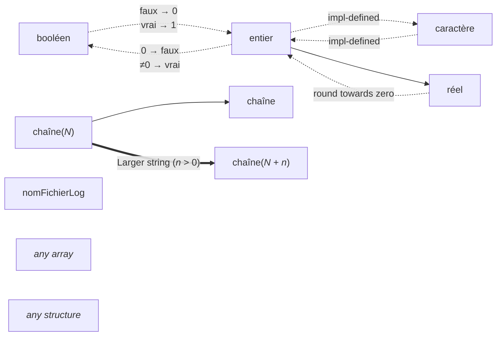

# Conversions

This is a graph of the allowed conversions between types.

Link shape|Conversion kind
-|-
Solid|implicit
Dotted|explicit (with cast syntax)
Thick|assigment only

---

When a conversion is **impl-defined**, the result depends on the rules of the target language.

When a conversion's result isn't specified, identity is assumed.
