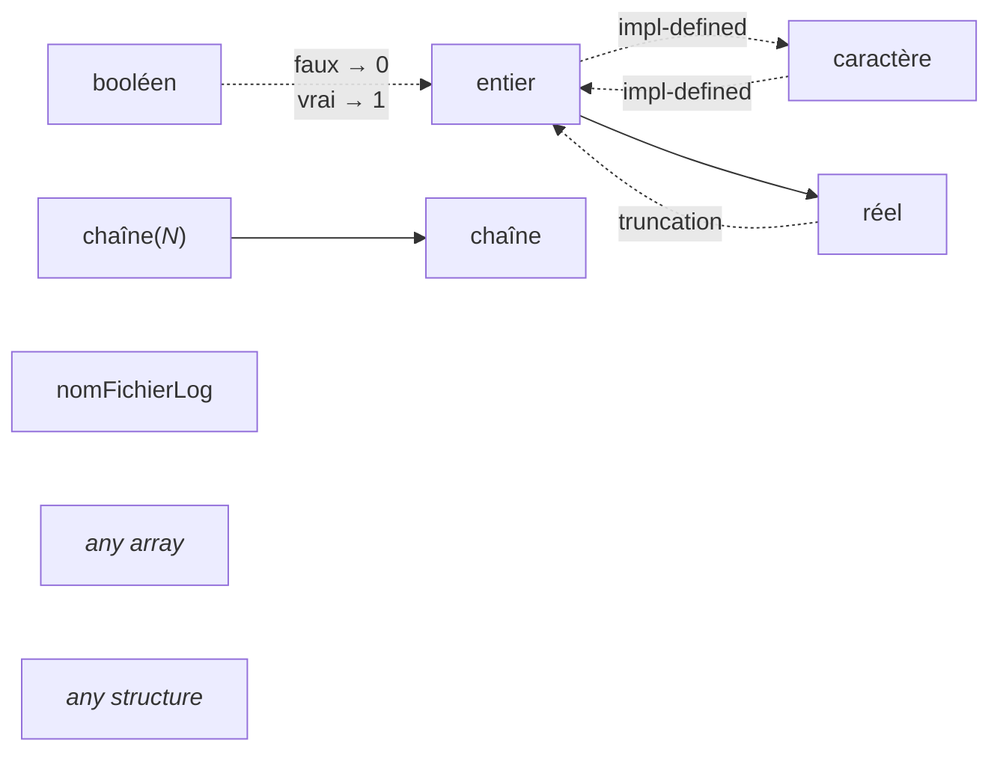

# Conversions

This is a graph of the allowed implicit and explicit conversions between types.

Legend:

- Dotted link: implicit conversion
- Solid link: explicit conversion (with cast syntax)

When the result of a conversion is **impl-defined**, it means it depends on the rules of the target language.

When the result of a conversion isn't mentioned, identity is assumed.
