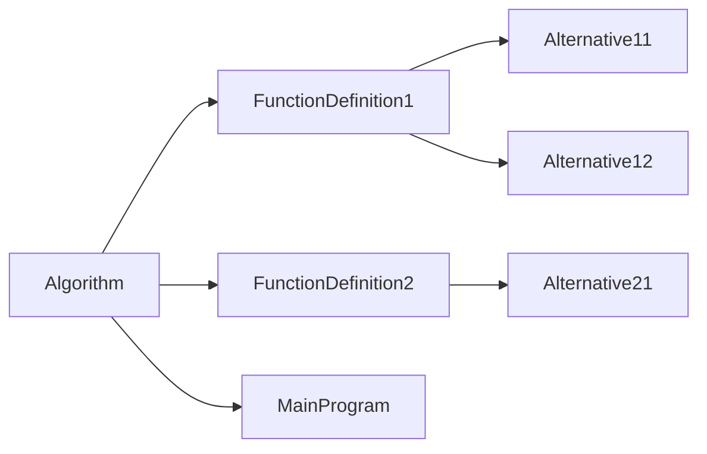

# Done

## Building a failure-resilient ParseOperation

There are 3 possible outcomes of a parsing method:

- Success : keep going
- Light failure : return the failed result, keep going
- Critical failure : return the failed result, switch to the failure implementation

The failure either has to go to a place and only one place, either in the out ParseResult parameter, or in the return value.
We should make failures "light" as much as possible.

So for `ParseToken(TokenType type, out ParseResult<string> value)`, we will never return an ErroneousOperation and failure will be indicated by assigning value to a failed ParseResult.

But for `ParseToken(TokenType type)`, we don't have anywhere else for the value to go so we return an ErroneousOperation as we currenlty do.

## Multiple possibilities in parsing

Ok, so whenever there are multiple possibilities for a production rules, what we currently do is that
we peek the first token, and we call a specific parsing method depending on its type.

Currently, we do this for

- Statements
- Literals

There is also an alternative for parsing expressions, but we're using a different method:

We're calling the ParseResult.Else() extension method to try each alternative until one succeeds

This method combines the errors that occur.

## Complete types

Do we need to differentiate between complete types and incomplete types?

An incomplete type is basically an unlengthed string, a complete type is any other type.

For a type to be completes means that it specifies all required information to store an instance of it.

So an unlengthed string is not a compelete type because you don't know the length of the string, i.e. the number of bytes to allocate.

Sames goes for an array of unlenghted strings

In variable declarations we allow only complete types because that's when we allocate memory.

This distinction also exists in C:

```c
char str[10]; // complete
char *str; // incomplete

void func(
    char str[10],
    char *str // incomplete
)
{
    // ...
}
```

In Pseudocode:

```psc
str : chaîne(10); // ok
str : chaîne;     // interdit

procédure func(
    entF str : chaîne(10) // ok
    entF str : chaîne     // ok
)
```

The difference between a variable and a parameter declaration is that, in a variable declaration, we actually allocate the underlying data, whereas in a parameter declaration we only pass it, we don't instanciate anything. All we do is copy a pointer.

In a way parameters are consumers and variables are providers.

We do differ between complete and incomplete types, not in the types of nodes, but in the parsing.

The set of complete types is a subset of all types.

## For loops

Note : we assume that start <= end : `for (i = start; i <= end; i += step)`

if start > end, then step must be < 0 : `for (i = start; i >= end; i += step)`

Solution 1 : use safe version : `for (i = start; step < 0 ? i >= end : i <= end; i += step)`

**Solution 2** : disallow decreasing variant (but we won't be able to diagnose the issue, simply ignore the problem)

Solution 3 : require *step* to be a compile-time constant so we can choose to either `<=` or `>=` at compile-time instead of at run-time like Solution 1. This would require

- expression evaluation
- constant folding

## What constitutes to be a ParseResult

Rule for what belongs in a parse result:

Don't ParseResult collections, parse result the element type. Having collection properties basically means that we have a variadic node.

No parse result if the node can't exist without it such as when

- the only token parsed is a property (such as Literals)
- allowing a hole will result in too permissive parsing

Two kinds of properties

- Identity properties : the node is the property -> no ParseResult
- Composition properties : the node contains the property -> yes ParseResult

Examples

- Node.Expression.Literal.Integer(string Value) -> no ParseResult
- Node.Type.LengthedString(`ParseResult<Expression> Length`) -> yes ParseResult

Having a component encapsulated in a `ParseResult` in a node type means that we allow the outer node to exist even if this component has failed parsing. This prevents the parsing to stop for the node.

So this is mostly useful for "big" nodes like callables.

## "Helper" rules in formal grammar

Where to put "helper" rules in the formal grammar?

"Helper" rules are rules that carry no meaning on their own and are only used in the construction of more complex rules. Example: formal parameters.

They belong to the category of all the rules they are used to construct.

## SourceTokens madness

Okay so currently we keep track of sourcetokens in lists. But that's useless since the tokens are in order and the list of original tokens never changes. So all we really need are a start index and a length. That will simplify the code and improve performance.

## Simplification

The code has become a big mess because we've made the wrong choices.

First of all, it's not the code generator role's to generate syntax errors. It would be the duty of the parser.

Second of all, the way we handle failure is all wrong. Having everyting wrapped in `ParseResult`s results in tons of boilerplate code.

So I propose ge get rid of `ParseResult` entirely.

So how do we handle failure now?

Well let's take an example of what a failure may look like:

```text
retourne result
```

We've forgotten the terminating semicolon in that return statement.

What we do now is we add a failed return statement to the AST, and the code generator registers a syntax error for it when it tries to generate it.

There's not need to have the code generator involved here at all.

Just account for the failure, add an error message, and move on.

## Multiparsing madness

Stop failing and retrying with a diferent parser, and combinding the erros that occur, all based on the first token which is parsed twice.

We're parsing things multiple times and it makes no sense.

Let's build a tree so that the common parts of parsers can be shared.

We'll need a way to branch in the parser

Start with assignements and variable declarations.

Remaining Elses to eliminate

- ~~in ParseAliasDeclaration~~
- ~~in ParseType~~
- ~~in ParseExpression1~~
- ~~in ParseArraySubscript~~

~~Eliminate ParseEither?~~

## Map operator types

Right now operators in bin and unary expressions are TokenType. This makes no sense.

## Symbol table tree

We need a tree for symbol tables :



\#|situation|action
-|-|-
1|entering Algorithm (start)|Push
2|entering FunctionDefinition1|Push
3|entering Alternative11|Push
4|leaving Alternative11|Pop
5|entering Alternative12|Next, Push
6|leaving Alternative12|Pop
7|leaving FunctionDefinition1|Pop
8|entering FunctionDefinition2|Next, Push
9|entering Alternative21|Push
10|leaving Alternative21|Pop
11|leaving FunctionDefinition2|Pop
12|entering MainProgram|Next, Push
13|leaving MainProgram|Pop

Note that each node in this tree corresponds to a specific type of node in the AST.

This means we could associate symbol tables with such nodes by having them implement an interface, like `ScopedNode`

Now in semantic analysis we can populate these symbol tables and consume them in the code generator.

## ~~Node~~ Symbol equality

Node equality doesn't depend on SourceTokens.

actually we didn't need it, we need **Symbol Equality** (which need Node.Expression equality so it's ok)

## semantic analysis pass

Semantic analysis that will perform the following before code generation (so code generation needs no matchsome)

- create Symbols and register errors
    - redefined symbol
    - undefined symbol
- replace the Node.Type(s) in the AST by TypeInfo(s) and register errors
    - can't infer expression type

Returns:

- scopes with symbol tables (Scope)
- dictionary from Node.Type to TypeInfo

Point in codegenerator:

- no more CreateType
- no more symbol creation
- no more _scope

i think i should not worry about writing abstracted code so compilation to another language could be added. its makes the code confusing.

## ~~abstraction for AST traversal~~

AST is traversed in

- code generator
- semantic analysis

define abstract class AstTraverser. Defines traversal logic and abstract methods.

What it does : traverse every node in the AST and call the appropriate Handle method

When it finds a node, it will traverse any child nodes, (including in collections)

So the consumer only has to worry about terminal parts of nodes (such as the name of an algorithm)

Handlers are called in the order the nodes would appear in the original code.

Actually forget it. It's teribble. The issue comes from order of traversal.

Take we encounter a while loop.

1. HandleWhileLoop -> `while (`
2. HandleExpression... -> (generated expression)
3. multiple HandleStatement -> (generated statement)

Where does the closing bracket go? The HandleWhileLoop handler could have put it but since it doesn't generate the condition it cannot.

So it needs to generate the condition

So Walker cannot go into the components of nodes.

So it serves no purpose? Does it? Not really. It can't do anything useful.

## a Node should have SourceTokens

this is needed for errors in Semantic analysis

## TypeInfo and primitive obsession

Array dimensions and lengthed string length should not be strings

We're using strings to represent thing that we previously expressions.

Should we use Node.Expression?

TypeInfo is used to generate types. If we use Node.Expression, we will need to generate it somehow.

But only the codegenerator knows how to generate a Node.Expression and transorm it into a string.

Maybe TypeInfo shouldn't be responsible for generating itself.

What is a TypeInfo?

A TypeInfo abstracts a type. It can be used to generate a Node.Type or to represent the Type of an expression.

As of now, A TypeInfo knows how to generate itself into C code.

I think we should separate the type representation from the type generation roles.

## Protypes and redefined symbols

Functions and procedures are naturally defined 1 + N times, where N is the amount of prototypes.

Yes we will allow more than one prototype.

But we will have to compare them, make sure they're all the same

- Upon encountering a declaration (prototype)
    - Try to add a function symbol
    - If it already exists, compare it to the existing one
    - If they're different, cause error
    - If they're the same, do nothing
- Upon encountering a definition
    - Add a function symbol
    - If it exists already, it can mean either
        - there was a prototye before
        - redefinition of a prototype-less function

**problem** : we can't differenciate bewteen those 2 cases

We need a FunctionPrototype symbol.

- Upon encountering a declaration (prototype)
    - Try to add a FunctionPrototype symbol
    - If it already exists, compare it to the existing one
        - If they're different, cause error
        - If they're the same, do nothing
- Upon encountering a definition
    - If a FunctionPrototype symbol of the same name exists
        - If they're different, cause error
        - If they're the same, do nothing
    - Add a Function symbol and error if it exists already

**problem** : actually this wouldn't work either because we would be limited to 1 FunctionPrototype per name

We need to make Symbol.Function mutable by adding a boolean value, HasBeenDefined

- Upon encountering a declaration (prototype)
    - Try to add a Function
    - If already exists compare it to the existing one
        - If they're different, cause error
- Upon encountering a definition
    - Try to add a Function
    - If added
        - call MarkAsDefined
    - If exists
        - If HasBeenDefined
            - cause error, redefinition
        - Else
            - call MarkAsDefined

## Scopes

currently scopes are associated with ast nodes

the issue is that we need access to the parent scope to retrieve symbols.

currently Scope has a `Scope? ParentScope` field. This means it's up to the Parser to create the scope hierarchy. This is wrong.

- solution 1 : remove Scope from nodes and build a scope tree in the semantic analyzer (will have to be traversed in semantic analyzer & code generator)
- **solution 2** : semantic analyzer will create the scopes
