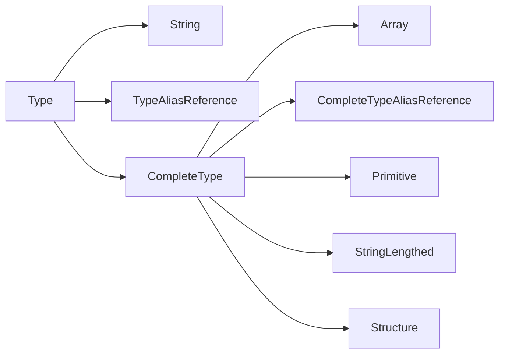
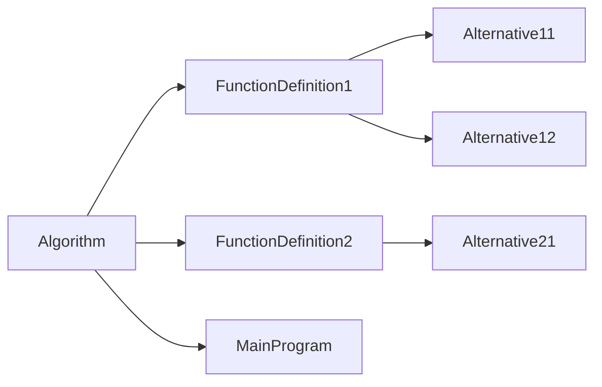
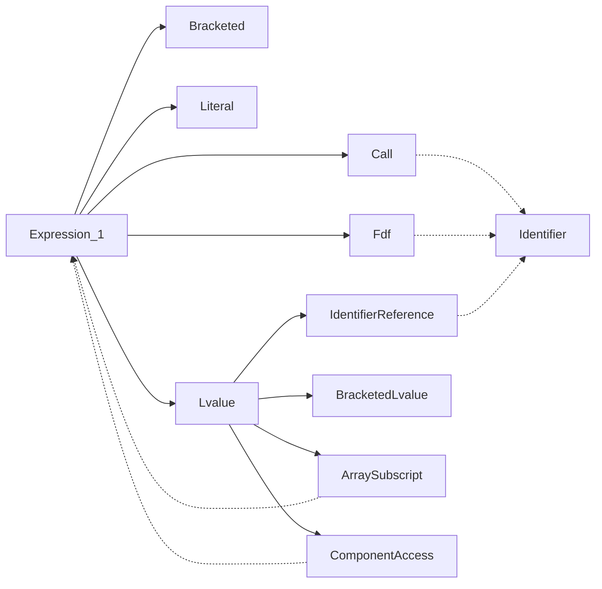
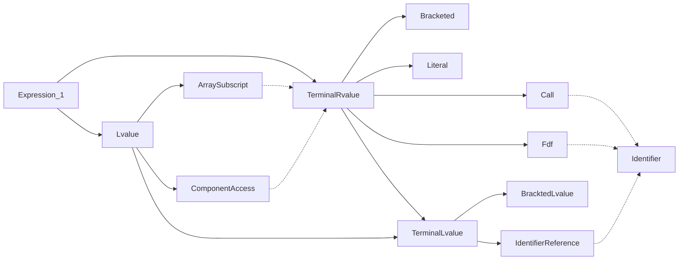

# Done

## Building a failure-resilient ParseOperation

There are 3 possible outcomes of a parsing method:

- Success : keep going
- Light failure : return the failed result, keep going
- Critical failure : return the failed result, switch to the failure implementation

The failure either has to go to a place and only one place, either in the out ParseResult parameter, or in the return value.
We should make failures "light" as much as possible.

So for `ParseToken(TokenType type, out ParseResult<string> value)`, we will never return an ErroneousOperation and failure will be indicated by assigning value to a failed ParseResult.

But for `ParseToken(TokenType type)`, we don't have anywhere else for the value to go so we return an ErroneousOperation as we currenlty do.

## Multiple possibilities in parsing

Ok, so whenever there are multiple possibilities for a production rules, what we currently do is that
we peek the first token, and we call a specific parsing method depending on its type.

Currently, we do this for

- Statements
- Literals

There is also an alternative for parsing expressions, but we're using a different method:

We're calling the ParseResult.Else() extension method to try each alternative until one succeeds

This method combines the errors that occur.

## Complete types

Do we need to differentiate between complete types and incomplete types?

An incomplete type is basically an unlengthed string, a complete type is any other type.

For a type to be completes means that it specifies all required information to store an instance of it.

So an unlengthed string is not a compelete type because you don't know the length of the string, i.e. the number of bytes to allocate.

Sames goes for an array of unlenghted strings

In variable declarations we allow only complete types because that's when we allocate memory.

This distinction also exists in C:

```c
char str[10]; // complete : ok
char str[]; // incomplete : error

void func(
    char str[10], // complete : ok
    char str[] // incomplete : ok
)
{
    // ...
}
```

In Pseudocode:

```psc
str : chaîne(10); // ok
str : chaîne;     // interdit

procédure func(
    entF str : chaîne(10) // ok
    entF str : chaîne     // ok
)
```

The difference between a variable and a parameter declaration is that, in a variable declaration, we actually allocate the underlying data, whereas in a parameter declaration we only pass it, we don't instanciate anything. All we do is copy a pointer.

In a way parameters are consumers and variables are providers.

We do differ between complete and incomplete types, not in the types of nodes, but in the parsing.

The set of complete types is a subset of all types.

There is an issue though. What about aliases? They can contain either a complete or incomplete type. And we can't define separate productions for a `CompleteTypeAlias` and a `TypeAlias` as the reference productions (`CompleteTypeAliasReference` and `TypeAliasReference`) would have the same source tokens?

I think there's a way. Anything that we can do in the parser will be less clutter in the static analyzer. Let's make a tree.



When we need a Type, we will first parse a CompleteType (since it can do more than an incomplete type), which includes CompleteTypeAliasReference. It that fails, we will `.Else()` to TypeAliasReference and lastly String.

## For loops

Note : we assume that start <= end : `for (i = start; i <= end; i += step)`

if start > end, then step must be < 0 : `for (i = start; i >= end; i += step)`

Solution 1 : use safe version : `for (i = start; step < 0 ? i >= end : i <= end; i += step)`

**Solution 2** : disallow decreasing variant (but we won't be able to diagnose the issue, simply ignore the problem)

Solution 3 : require *step* to be a compile-time constant so we can choose to either `<=` or `>=` at compile-time instead of at run-time like Solution 1. This would require

- expression evaluation
- constant folding

## What constitutes to be a ParseResult

Rule for what belongs in a parse result:

Don't ParseResult collections, parse result the element type. Having collection properties basically means that we have a variadic node.

No parse result if the node can't exist without it such as when

- the only token parsed is a property (such as Literals)
- allowing a hole will result in too permissive parsing

Two kinds of properties

- Identity properties : the node is the property -> no ParseResult
- Composition properties : the node contains the property -> yes ParseResult

Examples

- Node.Expression.Literal.Integer(string Value) -> no ParseResult
- Node.Type.LengthedString(`ParseResult<Expression> Length`) -> yes ParseResult

Having a component encapsulated in a `ParseResult` in a node type means that we allow the outer node to exist even if this component has failed parsing. This prevents the parsing to stop for the node.

So this is mostly useful for "big" nodes like callables.

## "Helper" rules in formal grammar

Where to put "helper" rules in the formal grammar?

"Helper" rules are rules that carry no meaning on their own and are only used in the construction of more complex rules. Example: formal parameters.

They belong to the category of all the rules they are used to construct.

## SourceTokens madness

Okay so currently we keep track of sourcetokens in lists. But that's useless since the tokens are in order and the list of original tokens never changes. So all we really need are a start index and a length. That will simplify the code and improve performance.

## Simplification

The code has become a big mess because we've made the wrong choices.

First of all, it's not the code generator role's to generate syntax errors. It would be the duty of the parser.

Second of all, the way we handle failure is all wrong. Having everyting wrapped in `ParseResult`s results in tons of boilerplate code.

So I propose ge get rid of `ParseResult` entirely.

So how do we handle failure now?

Well let's take an example of what a failure may look like:

```text
retourne result
```

We've forgotten the terminating semicolon in that return statement.

What we do now is we add a failed return statement to the AST, and the code generator registers a syntax error for it when it tries to generate it.

There's not need to have the code generator involved here at all.

Just account for the failure, add an error message, and move on.

## Multiparsing madness

Stop failing and retrying with a diferent parser, and combinding the erros that occur, all based on the first token which is parsed twice.

We're parsing things multiple times and it makes no sense.

Let's build a tree so that the common parts of parsers can be shared.

We'll need a way to branch in the parser

Start with assignements and variable declarations.

Remaining Elses to eliminate

- ~~in ParseAliasDeclaration~~
- ~~in ParseType~~
- ~~in ParseExpression1~~
- ~~in ParseArraySubscript~~

~~Eliminate ParseEither?~~

## Map operator types

Right now operators in bin and unary expressions are TokenType. This makes no sense.

## Symbol table tree

We need a tree for symbol tables :



\#|situation|action
-|-|-
1|entering Algorithm (start)|Push
2|entering FunctionDefinition1|Push
3|entering Alternative11|Push
4|leaving Alternative11|Pop
5|entering Alternative12|Next, Push
6|leaving Alternative12|Pop
7|leaving FunctionDefinition1|Pop
8|entering FunctionDefinition2|Next, Push
9|entering Alternative21|Push
10|leaving Alternative21|Pop
11|leaving FunctionDefinition2|Pop
12|entering MainProgram|Next, Push
13|leaving MainProgram|Pop

Note that each node in this tree corresponds to a specific type of node in the AST.

This means we could associate symbol tables with such nodes by having them implement an interface, like `ScopedNode`

Now in static analysis we can populate these symbol tables and consume them in the code generator.

## ~~Node~~ Symbol equality

Node equality doesn't depend on SourceTokens.

actually we didn't need it, we need **Symbol Equality** (which need Node.Expression equality so it's ok)

## static analysis pass

Static analysis that will perform the following before code generation (so code generation needs no matchsome)

- create Symbols and register errors
    - redefined symbol
    - undefined symbol
- replace the Node.Type(s) in the AST by TypeInfo(s) and register errors
    - can't infer expression type

Returns:

- scopes with symbol tables (Scope)
- dictionary from Node.Type to TypeInfo

Point in codegenerator:

- no more CreateType
- no more symbol creation
- no more _scope

i think i should not worry about writing abstracted code so compilation to another language could be added. its makes the code confusing.

## ~~abstraction for AST traversal~~

AST is traversed in

- code generator
- static analysis

define abstract class AstTraverser. Defines traversal logic and abstract methods.

What it does : traverse every node in the AST and call the appropriate Handle method

When it finds a node, it will traverse any child nodes, (including in collections)

So the consumer only has to worry about terminal parts of nodes (such as the name of an algorithm)

Handlers are called in the order the nodes would appear in the original code.

Actually forget it. It's teribble. The issue comes from order of traversal.

Take we encounter a while loop.

1. HandleWhileLoop -> `while (`
2. HandleExpression... -> (generated expression)
3. multiple HandleStatement -> (generated statement)

Where does the closing bracket go? The HandleWhileLoop handler could have put it but since it doesn't generate the condition it cannot.

So it needs to generate the condition

So Walker cannot go into the components of nodes.

So it serves no purpose? Does it? Not really. It can't do anything useful.

## a Node should have SourceTokens

this is needed for errors in Static analysis

## TypeInfo and primitive obsession

Array dimensions and lengthed string length should not be strings

We're using strings to represent thing that we previously expressions.

Should we use Node.Expression?

TypeInfo is used to generate types. If we use Node.Expression, we will need to generate it somehow.

But only the codegenerator knows how to generate a Node.Expression and transorm it into a string.

Maybe TypeInfo shouldn't be responsible for generating itself.

What is a TypeInfo?

A TypeInfo abstracts a type. It can be used to generate a Node.Type or to represent the Type of an expression.

As of now, A TypeInfo knows how to generate itself into C code.

I think we should separate the type representation from the type generation roles.

## Protypes and redefined symbols

Functions and procedures are naturally defined 1 + N times, where N is the amount of prototypes.

Yes we will allow more than one prototype.

But we will have to compare them, make sure they're all the same

- Upon encountering a declaration (prototype)
    - Try to add a function symbol
    - If it already exists, compare it to the existing one
    - If they're different, cause error
    - If they're the same, do nothing
- Upon encountering a definition
    - Add a function symbol
    - If it exists already, it can mean either
        - there was a prototye before
        - redefinition of a prototype-less function

**problem** : we can't differenciate bewteen those 2 cases

We need a FunctionPrototype symbol.

- Upon encountering a declaration (prototype)
    - Try to add a FunctionPrototype symbol
    - If it already exists, compare it to the existing one
        - If they're different, cause error
        - If they're the same, do nothing
- Upon encountering a definition
    - If a FunctionPrototype symbol of the same name exists
        - If they're different, cause error
        - If they're the same, do nothing
    - Add a Function symbol and error if it exists already

**problem** : actually this wouldn't work either because we would be limited to 1 FunctionPrototype per name

We need to make Symbol.Function mutable by adding a boolean value, HasBeenDefined

- Upon encountering a declaration (prototype)
    - Try to add a Function
    - If already exists compare it to the existing one
        - If they're different, cause error
- Upon encountering a definition
    - Try to add a Function
    - If added
        - call MarkAsDefined
    - If exists
        - If HasBeenDefined
            - cause error, redefinition
        - Else
            - call MarkAsDefined

## Scopes

currently scopes are associated with ast nodes

the issue is that we need access to the parent scope to retrieve symbols.

currently Scope has a `Scope? ParentScope` field. This means it's up to the Parser to create the scope hierarchy. This is wrong.

- solution 1 : remove Scope from nodes and build a scope tree in the static analyzer (will have to be traversed in static analyzer & code generator)
- **solution 2** : static analyzer will create the scopes

## SourceTokens shouldn't contain the token that caused the error

SourceTokens indicates how far we've come in the parsing.

The `Token` that caused the error will now be stored in `ParseError`.

The reason is that by putting too much in source tokens, we increase `_readCount` in `ParseOperation` too far ahead which causes us to miss important tokens for further parsing.

Example:

```text
programme Hello c'est
début
    écrireÉcran("Hello")
    écrireÉcran("Hello");
fin
```

Here the first `écrireÉcran` misses the terminating semi-colon. This causes a syntax error. The source tokens are incomplete first statement. In the old system, we would also have had the second `écrireÉcran` keyword. This was invalid.

However we will still add SourceToken of failed inbound ParseResults in `ParseOperation` methods like `Parse`.

## Better TokenType names

Currently we end up showing the type name which is dirty.

```cs
internal sealed class TokenType
{
    private TokenType(string displayName) => DisplayName = displayName;

    public string DisplayName { get; }

    public static TokenTypeNew OpenBracket { get; } = new("(");
}
```

## ParseError production name

Currently the production name is given by the `T` of the `ParseResult`. However that's innacurate as when `ParseError`s are passed around, the `T` will change and we may get inacurrate error.

Fix : add a stirng property, `ProductionName` to `ParseError` and use it in `ErrorSyntax()` (which will no longer need to be generic).

## identifier and primitive obsession

Create an `Identifier` class that abstracts a string but with restrictions (`[\p{L}_][\p{L}0-9_]*`)

The point would be to prevent invalid identifiers. But we already check in the tokenizer. So what's the point?

Semantically, it would able us to tell if an indentifier is expected instead of any string.

This could be useful for string constants.

## More complex static analysis

Problem : how to implement the "output parameter never assigned errror"

We can have a boolean in the {Procedure, Function}Definition case of AnalyzeDeclaration.

Add a hook parameter to `HandleScopedBlock` that will recieve the statement

## Lvalue/rvalue

We need to differenciate between lvalues and rvalues in the formal grammar, the ast and the parser.

So we don't allow things like `lireClavier(69)`

Also we need to change our formal grammar with assignment, currently it only allows identifiers as the left operands :

`target := value`

However arrays exist:

`array[5] := value`

`array[indice / 2 + 4] := value`

And structures:

`bar.c_foo := value`

---

I can no longer postpone this

Representing Rvalues with Node.Expressions and Lvalues with strings is no longer enough as structure component access and array subscript expressions may be used as Lvalues.

Should we update our formal grammar?

Yes. We need some sort of restriction on which expressions can be lvalues so we don't allow horrors such as

`1 + 1 := 3;`

The problem is for bracketed expressions. `lireClavier((val))` is just as valid as `lireClavier(val)`.

So a `Bracketed` can contain either an lvalue or rvalue, what it is it defined on its contents. I guess we can add an abstract boolean property `IsLvalue` on `Expression`. This property will be used by the static analyzer?

So the parser will allow assigning to lvalues but it's the static analyzer that will catch the error. Is this a good idea?

Since there's not only assignments to worry about, there's also `lireClavier` and actual output parameters.

But at the same time it would be better to use types, and the custom error message can be given by an error production.

I'm having trouble organizing the formal grammar. I have to put these below `Expression_1`:

- bracketed
- call
- fdf
- literal
- lvalue
    - bracketed lvalue
    - array subscript
    - component access
    - identifier

But there's a catch : array subscript and component access start with any expression, so they will recurse infinitely if they can parse themselves.

Let's show it with a tree based on the AST (solid arrow is identity, dotted arrow is first composition, dotted circle is other compisitons)

To ensure every parsing siutation works, **any node must be linked \[in\]directly to any other node on the right.**



How do we eliminate those 2 cycles?



Nice.

## Structure definitions should be types

Just like in C.

## Cascading errors in static analysis

```text
[P0004] L 36, col 11: error: type alias `t_personne` undefined in current scope
    35 |     tmp : t_personne;
       |           ^^^^^^^^^^
[P0004] L 37, col 5: error: variable `tmp` undefined in current scope
    36 |     tmp := p1;
       |     ^^^
[P0004] L 39, col 11: error: variable `tmp` undefined in current scope
    38 |     p2 := tmp;
       |           ^^^
```

We need a way to differenciate "this variable doesn't exist" from "the type of this variable doesn't exist".

We can add a special kind of evaluated type : `EvaluatedType.Unknown`

But what do we do with it in `TypeInfoC`? If we have a variable of an unknown type, we'll have to generate its type to something.

We could try to infer the type from the usage but that would be complex to implement, and there's not guarantee of success. Plus it's probably not what the user would expect.

An unknown type would most likely be a non-existing type alias due to a spelling error in the typename.

We could generate it to something like `<error-type>` but that would mean we have a possibility of generating invalid code.

So we shouldn't generate the declaration?
In that case we shouldn't generate usage either.

No no no, this is wrong. I don't want to strip portions of the user code just because they typed a letter twice in the type of a frequently-used variable.

So we **will** allow generating invalid code. The user will review it after transpilation anyways, so if there's an error they have a choice, either modify the result or the source.

This can be useful in scenarios when you can't modify the source as it's from a document.

But then, *what are we generating*? If we can't guarantee it will be valid code, what is it?

Well, it's the closest program in the target language that matches the semantics and expected behavior (if it is correct) of the input program.

Matching semantics also means matching errors.

So we're back to square 1. What do we put in TypeInfo?

I know. The input code.

## More details for signature mismatch error

It would be nice to provide more details.

Maybe we can add them as notes?

### on call

- wrong mode for `name`: expected `entE`, got `sortE`
- wrong type for `name`: expected `entier`, got `réel`
- incorrect number of arguments: expected X, got X

## Parsing trees

Currently, our overload of `Branch` that returns a `ParseOperation` so the parsing doesn't work, as it fails to account for tokens parsed after the merge.

Changed the forking system to fix that.
