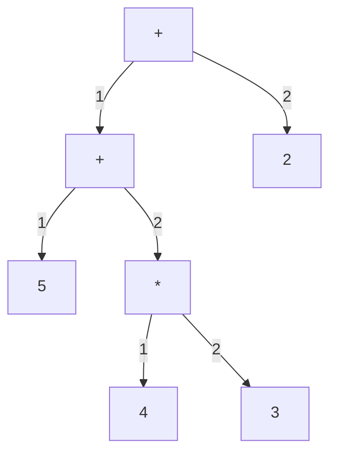
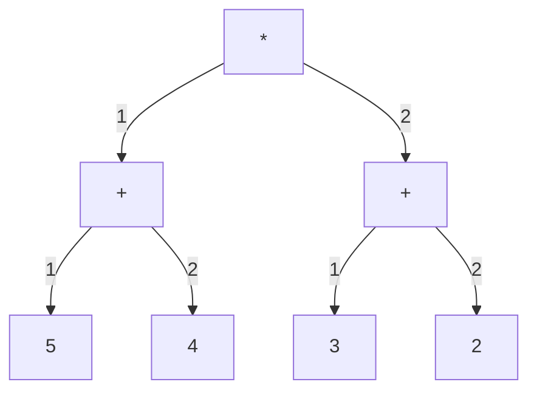
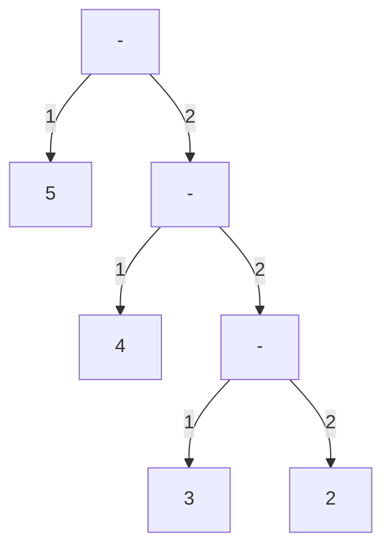
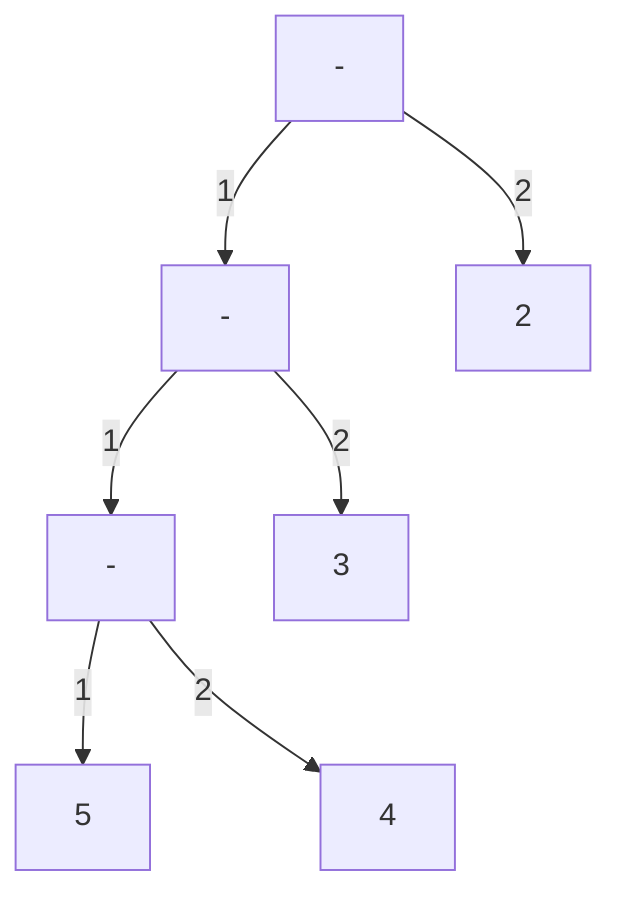
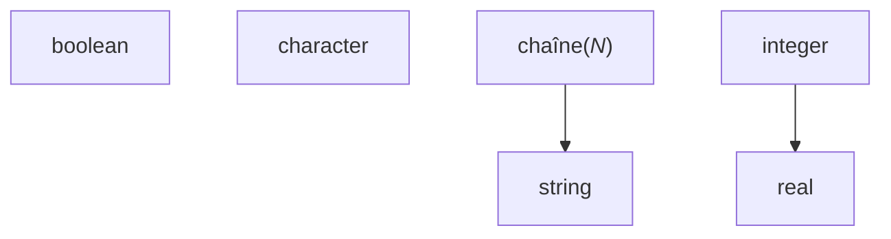

# Done

## Building a failure-resilient ParseOperation

There are 3 possible outcomes of a parsing method:

- Success : keep going
- Light failure : return the failed result, keep going
- Critical failure : return the failed result, switch to the failure implementation

The failure either has to go to a place and only one place, either in the out ParseResult parameter, or in the return value.
We should make failures "light" as much as possible.

So for `ParseToken(TokenType type, out ParseResult<string> value)`, we will never return an ErroneousOperation and failure will be indicated by assigning value to a failed ParseResult.

But for `ParseToken(TokenType type)`, we don't have anywhere else for the value to go so we return an ErroneousOperation as we currenlty do.

## Multiple possibilities in parsing

Ok, so whenever there are multiple possibilities for a production rules, what we currently do is that
we peek the first token, and we call a specific parsing method depending on its type.

Currently, we do this for

- Statements
- Literals

There is also an alternative for parsing expressions, but we're using a different method:

We're calling the ParseResult.Else() extension method to try each alternative until one succeeds

This method combines the errors that occur.

## Complete types

Do we need to differentiate between complete types and incomplete types?

An incomplete type is basically an unlengthed string, a complete type is any other type.

For a type to be completes means that it specifies all required information to store an instance of it.

So an unlengthed string is not a compelete type because you don't know the length of the string, i.e. the number of bytes to allocate.

Sames goes for an array of unlenghted strings

In variable declarations we allow only complete types because that's when we allocate memory.

This distinction also exists in C:

```c
char str[10]; // complete : ok
char str[]; // incomplete : error

void func(
    char str[10], // complete : ok
    char str[] // incomplete : ok
)
{
    // ...
}
```

In Pseudocode:

```psc
str : chaîne(10); // ok
str : chaîne;     // interdit

procédure func(
    entF str : chaîne(10) // ok
    entF str : chaîne     // ok
)
```

The difference between a variable and a parameter declaration is that, in a variable declaration, we actually allocate the underlying data, whereas in a parameter declaration we only pass it, we don't instanciate anything. All we do is copy a pointer.

In a way parameters are consumers and variables are providers.

We do differ between complete and incomplete types, not in the types of nodes, but in the parsing.

The set of complete types is a subset of all types.

There is an issue though. What about aliases? They can contain either a complete or incomplete type. And we can't define separate productions for a `CompleteTypeAlias` and a `TypeAlias` as the reference productions (`CompleteTypeAliasReference` and `TypeAliasReference`) would have the same source tokens?

I think there's a way. Anything that we can do in the parser will be less clutter in the static analyzer. Let's make a tree.


When we need a Type, we will first parse a CompleteType (since it can do more than an incomplete type), which includes CompleteTypeAliasReference. It that fails, we will `.Else()` to TypeAliasReference and lastly String.

## For loops

Note : we assume that start <= end : `for (i = start; i <= end; i += step)`

if start > end, then step must be < 0 : `for (i = start; i >= end; i += step)`

Solution 1 : use safe version : `for (i = start; step < 0 ? i >= end : i <= end; i += step)`

**Solution 2** : disallow decreasing variant (but we won't be able to diagnose the issue, simply ignore the problem)

Solution 3 : require *step* to be a compile-time constant so we can choose to either `<=` or `>=` at compile-time instead of at run-time like Solution 1. This would require

- expression evaluation
- constant folding

## What constitutes to be a ParseResult

Rule for what belongs in a parse result:

Don't ParseResult collections, parse result the element type. Having collection properties basically means that we have a variadic node.

No parse result if the node can't exist without it such as when

- the only token parsed is a property (such as Literals)
- allowing a hole will result in too permissive parsing

Two kinds of properties

- Identity properties : the node is the property -> no ParseResult
- Composition properties : the node contains the property -> yes ParseResult

Examples

- Node.Expression.Literal.Integer(string Value) -> no ParseResult
- Node.Type.LengthedString(`ParseResult<Expression> Length`) -> yes ParseResult

Having a component encapsulated in a `ParseResult` in a node type means that we allow the outer node to exist even if this component has failed parsing. This prevents the parsing to stop for the node.

So this is mostly useful for "big" nodes like callables.

## "Helper" rules in formal grammar

Where to put "helper" rules in the formal grammar?

"Helper" rules are rules that carry no meaning on their own and are only used in the construction of more complex rules. Example: formal parameters.

They belong to the category of all the rules they are used to construct.

## SourceTokens madness

Okay so currently we keep track of sourcetokens in lists. But that's useless since the tokens are in order and the list of original tokens never changes. So all we really need are a start index and a length. That will simplify the code and improve performance.

## Simplification

The code has become a big mess because we've made the wrong choices.

First of all, it's not the code generator role's to generate syntax errors. It would be the duty of the parser.

Second of all, the way we handle failure is all wrong. Having everyting wrapped in `ParseResult`s results in tons of boilerplate code.

So I propose ge get rid of `ParseResult` entirely.

So how do we handle failure now?

Well let's take an example of what a failure may look like:

```text
retourne result
```

We've forgotten the terminating semicolon in that return statement.

What we do now is we add a failed return statement to the AST, and the code generator registers a syntax error for it when it tries to generate it.

There's not need to have the code generator involved here at all.

Just account for the failure, add an error message, and move on.

## Multiparsing madness

Stop failing and retrying with a diferent parser, and combinding the erros that occur, all based on the first token which is parsed twice.

We're parsing things multiple times and it makes no sense.

Let's build a tree so that the common parts of parsers can be shared.

We'll need a way to branch in the parser

Start with assignements and variable declarations.

Remaining Elses to eliminate

- ~~in ParseAliasDeclaration~~
- ~~in ParseType~~
- ~~in ParseExpression1~~
- ~~in ParseArraySubscript~~

~~Eliminate ParseEither?~~

## Map operator types

Right now operators in bin and unary expressions are TokenType. This makes no sense.

## Symbol table tree

We need a tree for symbol tables :


\#|situation|action
-|-|-
1|entering Algorithm (start)|Push
2|entering FunctionDefinition1|Push
3|entering Alternative11|Push
4|leaving Alternative11|Pop
5|entering Alternative12|Next, Push
6|leaving Alternative12|Pop
7|leaving FunctionDefinition1|Pop
8|entering FunctionDefinition2|Next, Push
9|entering Alternative21|Push
10|leaving Alternative21|Pop
11|leaving FunctionDefinition2|Pop
12|entering MainProgram|Next, Push
13|leaving MainProgram|Pop

Note that each node in this tree corresponds to a specific type of node in the AST.

This means we could associate symbol tables with such nodes by having them implement an interface, like `ScopedNode`

Now in static analysis we can populate these symbol tables and consume them in the code generator.

## ~~Node~~ Symbol equality

Node equality doesn't depend on SourceTokens.

actually we didn't need it, we need **Symbol Equality** (which need Node.Expression equality so it's ok)

## static analysis pass

Static analysis that will perform the following before code generation (so code generation needs no matchsome)

- create Symbols and register errors
    - redefined symbol
    - undefined symbol
- replace the Node.Type(s) in the AST by TypeInfo(s) and register errors
    - can't infer expression type

Returns:

- scopes with symbol tables (Scope)
- dictionary from Node.Type to TypeInfo

Point in codegenerator:

- no more CreateType
- no more symbol creation
- no more _scope

i think i should not worry about writing abstracted code so compilation to another language could be added. its makes the code confusing.

## ~~abstraction for AST traversal~~

AST is traversed in

- code generator
- static analysis

define abstract class AstTraverser. Defines traversal logic and abstract methods.

What it does : traverse every node in the AST and call the appropriate Handle method

When it finds a node, it will traverse any child nodes, (including in collections)

So the consumer only has to worry about terminal parts of nodes (such as the name of an algorithm)

Handlers are called in the order the nodes would appear in the original code.

Actually forget it. It's teribble. The issue comes from order of traversal.

Take we encounter a while loop.

1. HandleWhileLoop -> `while (`
2. HandleExpression... -> (generated expression)
3. multiple HandleStatement -> (generated statement)

Where does the closing bracket go? The HandleWhileLoop handler could have put it but since it doesn't generate the condition it cannot.

So it needs to generate the condition

So Walker cannot go into the components of nodes.

So it serves no purpose? Does it? Not really. It can't do anything useful.

## a Node should have SourceTokens

this is needed for errors in Static analysis

## TypeInfo and primitive obsession

Array dimensions and lengthed string length should not be strings

We're using strings to represent thing that we previously expressions.

Should we use Node.Expression?

TypeInfo is used to generate types. If we use Node.Expression, we will need to generate it somehow.

But only the codegenerator knows how to generate a Node.Expression and transorm it into a string.

Maybe TypeInfo shouldn't be responsible for generating itself.

What is a TypeInfo?

A TypeInfo abstracts a type. It can be used to generate a Node.Type or to represent the Type of an expression.

As of now, A TypeInfo knows how to generate itself into C code.

I think we should separate the type representation from the type generation roles.

## Protypes and redefined symbols

Functions and procedures are naturally defined 1 + N times, where N is the amount of prototypes.

Yes we will allow more than one prototype.

But we will have to compare them, make sure they're all the same

- Upon encountering a declaration (prototype)
    - Try to add a function symbol
    - If it already exists, compare it to the existing one
    - If they're different, cause error
    - If they're the same, do nothing
- Upon encountering a definition
    - Add a function symbol
    - If it exists already, it can mean either
        - there was a prototye before
        - redefinition of a prototype-less function

**problem** : we can't differenciate bewteen those 2 cases

We need a FunctionPrototype symbol.

- Upon encountering a declaration (prototype)
    - Try to add a FunctionPrototype symbol
    - If it already exists, compare it to the existing one
        - If they're different, cause error
        - If they're the same, do nothing
- Upon encountering a definition
    - If a FunctionPrototype symbol of the same name exists
        - If they're different, cause error
        - If they're the same, do nothing
    - Add a Function symbol and error if it exists already

**problem** : actually this wouldn't work either because we would be limited to 1 FunctionPrototype per name

We need to make Symbol.Function mutable by adding a boolean value, HasBeenDefined

- Upon encountering a declaration (prototype)
    - Try to add a Function
    - If already exists compare it to the existing one
        - If they're different, cause error
- Upon encountering a definition
    - Try to add a Function
    - If added
        - call MarkAsDefined
    - If exists
        - If HasBeenDefined
            - cause error, redefinition
        - Else
            - call MarkAsDefined

## Scopes

currently scopes are associated with ast nodes

the issue is that we need access to the parent scope to retrieve symbols.

currently Scope has a `Scope? ParentScope` field. This means it's up to the Parser to create the scope hierarchy. This is wrong.

- solution 1 : remove Scope from nodes and build a scope tree in the static analyzer (will have to be traversed in static analyzer & code generator)
- **solution 2** : static analyzer will create the scopes

## SourceTokens shouldn't contain the token that caused the error

SourceTokens indicates how far we've come in the parsing.

The `Token` that caused the error will now be stored in `ParseError`.

The reason is that by putting too much in source tokens, we increase `_readCount` in `ParseOperation` too far ahead which causes us to miss important tokens for further parsing.

Example:

```text
programme Hello c'est
début
    écrireÉcran("Hello")
    écrireÉcran("Hello");
fin
```

Here the first `écrireÉcran` misses the terminating semi-colon. This causes a syntax error. The source tokens are incomplete first statement. In the old system, we would also have had the second `écrireÉcran` keyword. This was invalid.

However we will still add SourceToken of failed inbound ParseResults in `ParseOperation` methods like `Parse`.

## Better TokenType names

Currently we end up showing the type name which is dirty.

```cs
internal sealed class TokenType
{
    private TokenType(string displayName) => DisplayName = displayName;

    public string DisplayName { get; }

    public static TokenTypeNew OpenBracket { get; } = new("(");
}
```

## ParseError production name

Currently the production name is given by the `T` of the `ParseResult`. However that's innacurate as when `ParseError`s are passed around, the `T` will change and we may get inacurrate error.

Fix : add a stirng property, `ProductionName` to `ParseError` and use it in `ErrorSyntax()` (which will no longer need to be generic).

## identifier and primitive obsession

Create an `Identifier` class that abstracts a string but with restrictions (`[\p{L}_][\p{L}0-9_]*`)

The point would be to prevent invalid identifiers. But we already check in the tokenizer. So what's the point?

Semantically, it would able us to tell if an indentifier is expected instead of any string.

This could be useful for string constants.

## More complex static analysis

Problem : how to implement the "output parameter never assigned errror"

We can have a boolean in the {Procedure, Function}Definition case of AnalyzeDeclaration.

Add a hook parameter to `HandleScopedBlock` that will recieve the statement

## Lvalue/rvalue

We need to differenciate between lvalues and rvalues in the formal grammar, the ast and the parser.

So we don't allow things like `lireClavier(69)`

Also we need to change our formal grammar with assignment, currently it only allows identifiers as the left operands :

`target := value`

However arrays exist:

`array[5] := value`

`array[indice / 2 + 4] := value`

And structures:

`bar.c_foo := value`

---

I can no longer postpone this

Representing Rvalues with Node.Expressions and Lvalues with strings is no longer enough as structure component access and array subscript expressions may be used as Lvalues.

Should we update our formal grammar?

Yes. We need some sort of restriction on which expressions can be lvalues so we don't allow horrors such as

`1 + 1 := 3;`

The problem is for bracketed expressions. `lireClavier((val))` is just as valid as `lireClavier(val)`.

So a `Bracketed` can contain either an lvalue or rvalue, what it is it defined on its contents. I guess we can add an abstract boolean property `IsLvalue` on `Expression`. This property will be used by the static analyzer?

So the parser will allow assigning to lvalues but it's the static analyzer that will catch the error. Is this a good idea?

Since there's not only assignments to worry about, there's also `lireClavier` and actual output parameters.

But at the same time it would be better to use types, and the custom error message can be given by an error production.

I'm having trouble organizing the formal grammar. I have to put these below `Expression_1`:

- bracketed
- call
- fdf
- literal
- lvalue
    - bracketed lvalue
    - array subscript
    - component access
    - identifier

But there's a catch : array subscript and component access start with any expression, so they will recurse infinitely if they can parse themselves.

Let's show it with a tree based on the AST (solid arrow is identity, dotted arrow is first composition, dotted circle is other compisitons)

To ensure every parsing siutation works, **any node must be linked \[in\]directly to any other node on the right.**


How do we eliminate those 2 cycles?


Nice.

## Structure definitions should be types

Just like in C.

## Cascading errors in static analysis

```text
[P0004] L 36, col 11: error: type alias `t_personne` undefined in current scope
    35 |     tmp : t_personne;
       |           ^^^^^^^^^^
[P0004] L 37, col 5: error: variable `tmp` undefined in current scope
    36 |     tmp := p1;
       |     ^^^
[P0004] L 39, col 11: error: variable `tmp` undefined in current scope
    38 |     p2 := tmp;
       |           ^^^
```

We need a way to differenciate "this variable doesn't exist" from "the type of this variable doesn't exist".

We can add a special kind of evaluated type : `EvaluatedType.Unknown`

But what do we do with it in `TypeInfoC`? If we have a variable of an unknown type, we'll have to generate its type to something.

We could try to infer the type from the usage but that would be complex to implement, and there's not guarantee of success. Plus it's probably not what the user would expect.

An unknown type would most likely be a non-existing type alias due to a spelling error in the typename.

We could generate it to something like `<error-type>` but that would mean we have a possibility of generating invalid code.

So we shouldn't generate the declaration?
In that case we shouldn't generate usage either.

No no no, this is wrong. I don't want to strip portions of the user code just because they typed a letter twice in the type of a frequently-used variable.

So we **will** allow generating invalid code. The user will review it after transpilation anyways, so if there's an error they have a choice, either modify the result or the source.

This can be useful in scenarios when you can't modify the source as it's from a document.

But then, *what are we generating*? If we can't guarantee it will be valid code, what is it?

Well, it's the closest program in the target language that matches the semantics and expected behavior (if it is correct) of the input program.

Matching semantics also means matching errors.

So we're back to square 1. What do we put in TypeInfo?

I know. The input code.

## More details for signature mismatch error

It would be nice to provide more details.

Maybe we can add them as notes?

### on call

- wrong mode for `name`: expected `entE`, got `sortE`
- wrong type for `name`: expected `entier`, got `réel`
- incorrect number of arguments: expected X, got X

## Parsing trees

Currently, our overload of `Branch` that returns a `ParseOperation` so the parsing doesn't work, as it fails to account for tokens parsed after the merge.

Changed the forking system to fix that.

## StringLenghted and constant folding

`StringLenghted` shouldn't exist. Only `StringKnownLength` should. That's because a string length should always be a constant value. But we can't enforce that right now because we cannot evaluate all constant expressions.

We will need constant folding. I didn't think we would, but we do. Hopefully it shouldn't be too hard.

It's weird that i need this for such a niche part, that is, controlling assignment between different string types.

```text
s1 : chaîne(20);

s2 : chaîne(10 + 10);

s2 := s1;
```

```c
char s1[20];
char s2[10 + 20];

// s1 = s2; // nope! can't reassign arrays in C.
strcpy(s1, s2);
strncpy(s1, s2, 20);
```

I *could* disallow reassigning lengthed strings entirely, but that feels like a pointless limitation. Considering that we've been taught to use `strcpy`, i should use it.

Also this means we won't need `IsConstant` anymore, since any expression that is constant will now be able have its value evaluated.

In order to generate the strcpy calls we will need something to control assignment in `TypeInfo` too.

Gosh this is getting complex. And I haven't even implemented the whole language yet.

I definitely will not use constant folding as an optimization though, because the objective of this whole project is to generate C code that matches the input in behavior **and** semantics.

same for array dimensions

We need to think about which operations we allow for which types.

Row header is the result type

Cells contain operand types. If there's only one it's the type of all operands. One supported operation per line.

arity|operator|booléen|caractère|chaîne|entier|réel
-|-|-|-|-|-|-
2|And|booléen|||||
2|Divide||||entier|réel|
2|Equal|booléen<br>caractère<br>chaîne<br>entier<br>réel|||||
2|GreaterThan|entier<br>réel|||||
2|GreaterThanOrEqual|entier<br>réel|||||
2|LessThan|entier<br>réel|||||
2|LessThanOrEqual|entier<br>réel|||||
2|Minus||||entier|réel|
2|Modulus||||entier|réel|
2|Multiply||||entier|réel|
2|NotEqual|booléen<br>caractère<br>chaîne<br>entier<br>réel|||||
2|Or|booléen|||||
2|Plus||||entier|réel|
1|UnaryMinus||||entier|réel|
1|UnaryNot|booléen|||||
1|UnaryPlus||||entier|réel|
2|Xor|booléen|||||

The Pseudocode type system is safe, albeit rather limited.

Strings only support equality. It wouldn't be hard to add support for comparision, but it gets confusing. What do we mean by `"foo" > "bar"`? The lexicographical comparison provided by `strcmp` is not obvious. And what about empty strings or strings of different lengths? Too many edge cases and choices to make. The user can implement string comparison themselves.
But it would be nice to have a `strcmp` standard library function available, so we have one way to compare strings without resorting to a custom implementation. Maybe one day.

Since we don't have casting, we must avoid arbitrary restrictions.

## Error on unsupported IO type

Should it be done in the static analysis or in the code generator?

It's target language specific, so in the code generator. We will need an abstraction for it eventually though.

## Alias reference unwrap madness

We need to prefix every operation we make with `EvaluatedType`s with Unwrap to get the true type by discarding any alias references in the way.

We need a different solution so the type of an instance is the same as its actual type (so we can perform is checks).

Maybe we can have a type remember which alias, if any it belongs to?

## Unified solution for operator precedence

For each code generator associate each operator with a precedence. So we always know whether to bracket an expression in non-terminal expressions.

The idea is to add brackets if necessary.

Let's start from a simple example.

With the expression `5 + 4 * 3 + 2`

We get the tree:



Equivalent : `((5 + (4 * 3)) + 2)`

But it is generated without brackets.

Generated : `5 + 4 * 3 + 2`

But what if the target language has a lower precedence for addition than for multiplication?

(lower = binds tigher).

The resulting expression would be interpred as such, without brackets:



To make it parse like before, we have to add brackets : `5 + (4 * 3) + 2`

Now let's factor in associativity. If we consider + to be RTL associative, the expression

`5 - 4 - 3 - 2`

would be interpreted as:



is parsed as:



We need to bracket like this : `((5 - 4) - 3) - 2`

When generating a binary operation, surround in brackets :

- left operand
    - when its precedence is > mine
    - or when its precedence = mine and my associativity is RTL and psdc associativity is LTR
- right operand
    - when its precedence is > mine
    - or when its precedence = mine and my associativity is LTR and psdc associativity is RTL

Unary operations : bracket when my operand's precedence is > mine

for macros, enclose in brackets if precedence is anything but the lowest.

Note that we don't need acceess to psdc's precedence values : the difference is enough.

## Possibility of duplicate errors

Errors may be duplicated between the static analyzer and the code generator.

The issue is that we're doing duplicate work to evaluate types. So maybe we should add a types lookup table.

## array indices

currently we do no translation, that's wrong.

c is 0 to n-1, psdc is 1 to n. So we have to substract one to each index.

Als it would be nice if we supported the syntax for arrays with custom index boundaries.

i just find it annoying how we have to put placeholder sourcetokens in order to generate the expression. I see 2 solutions to this.

1. Add a lookup table for source tokens, generated by the parser. We will need to encapsulate the algorithm node and the lookup table in an type Ast. That will result in some boilerplate in error handling since we'll have to give the ast everytime we want to create a message. Using a map also means there's always a risk of creating a bug by adding something twice or not adding it at all.

2. Have nodes and specifically expressions implement an interface without source tokens. We will need another concrete type for in vitro nodes. They will be defined in the Language namespace. The code generator will no longer depend on the parser as it will only consume the interfaces. We will need to triple every node type though. One for the classic node, one interface, and one in vitro node.

3. Just continue as we're doing now. Put empty source tokens or maybe a special sourcetokens instance to indicate the node has been generated in vitro.

We're going with solution 3 for now.

## expression evaluation issue

non-constant expressions are simply ignored.

What we need to do

- Static analysis AnalyzeExpression : evaluate the type of an expression.
- Static analysis > Constant symbol creation : get the untyped value of a constant expression
- Evaluated type ArraySubscript or LenghtedString creation : get the typed value of a constant expression

extract methods from these tasks.

For big projets, to prevent getting lost in the code, separate it in different subprojets.

Example for Psdc:

Problem|input|output
-|-|-
Getting the input|File or stdin|string
Lexing|string|sequence of tokens
Parsing|sequence of tokens|AST
Static analysis|AST|AST + ?
Code generator|AST + ?|C code

Right now i'm having trouble undertsanding the relation between static analysis and the code generator. This is the cause of my current problems.

What do the static analyzer acutally does ?

It generates errors and does some work to facilitate code generation. It enriches AST nodes with additional information:

Static analyzer|Code generator
-|-
Fills the scope of scoped nodes with symbols|Retrieves symbols by name from the node, for constant values, type alias types... information that can't be extracted from the node only (example for type alias : what if the type references another alias?)
Infers the type of each expression|Retrieved the inferred type from the expression node, and uses it to build format strings

Curiously, the code generator doesn't need the static analyzer for generating expressions.

So the only reason to analyze expressions in the static analyzer is :

- to help creating symbols (constant value...)
- to help with the evaluation of types (array dimensions...)
- to give helpful diagnostics in the form of messages (division by zero, floating point equality)

So what should we do?

Something to keep in mind, EvaluatedTypes and ConstantValues are loosely coupled. We can get a base EvaluatedType of a ConstantValue.Real, but nothing more precise. That may become an issue later.

Issue 1: evaluating a type does not operate the operations, we just do some rough guesswork in EvaluateTypeOperationBinary. This methods needs to go. We end up missing on a bunch of errors and we may get the wrong EvaluatedType since EvaluateTypeOperationBinary doesn't even take operators into account. This is not flexible and **we need a way to operate on types as well as values**.

Issue 2: evaluating a constant value results in duplicate errors : the ones from EvaluateType, and the ones from EvaluateValue.

Does that mean we need to merge EvaluatedTypes and ConstantValues in a single concept?

Well, does sometimes we want the type and sometimes we want the value? Not really, because a value always has a type. And we never really use the type on its own, except for getting errors and evaluating other expressions.

Soo... are you saying EvaluateType is useless? And this is why i couldn't design a proper abstraction? Because i was trying to fit something useless in it? Because in the span of a few days i forgot how half of my code works and i can't be bothered to read it? Dammit.

No. Actually, expression type evaluation has 2 uses:

- Comapring the actual parameter inferred type to the formal parameter declared type: error if different
- Comparing the constant value inferred type to the constant declared type: error if different.

A-ha.

Soo.. we need to be able to evaluated type type.

So we should remove all references to EvaluatedType from ConstantValue and return

`Option<(EvaluatedType, IEnumerable<OperationError>, Option<ConstantValue>)>` from `AnalyzeExpression`.

Okay but why the `Option`. It's there in case we can't evaluate the type. That could happen in case of an unsupported operator or symbol not found.

But we already have EvaluatedType.Unknown for these cases. The thing is, right now it's used only when evaluating `Node.Type` (`CreateTypeOrError`) because we need source tokens for its representation.

i didn't add a default instance because i didn't want to have to choose an arbitrary representation. but maybe i don't? maybe i can use the expression sourcetokens?

So what happens when we return a none evaluatedtype from `AnalyzeExpression` ?

- when analyzing a Node.Declaration.Constant, if the inferred value type is none, we don't even add the constant to the symbol table. This will lead to "symbol not found" errors later
- when analyzing an actual parameter, if the inferred argument type is none, we don't check the assignability (which is ok since unknown types are assignable to everything anyway).

There's not reason to annoy ourselves with a None when an evaluated type is just as well.

DONE: We will change `EvaluatedType.Unknown` to support smart constructor declared type (with sourcetokens) and inferred type (without sourcetokens).

Okay. Now we need to actually implement this.

I propose we

- DONE: Get rid of `EvaluateTypeOperationBinary` and associated; it is a relic from a primitive past of (static analyzer)lessness.
- DONE: make a record type `EvaluatedExpression`, containing members `EvaluatedType Type, Option<ConstantValue> Value`
- DONE: remove references to `EvaluatedType` from `ConstantValue`
- DONE: return `EvaluatedExpression` from `AnalyzeExpression`

Implementation of `AnalyzeExpression`

- Switch over every expression type
- For operations, we call methods

Should we report every error directly in the static analyzer or return them from `AstExtensions`?

We do call `EvaluateConstantValue` from `EvaluatedType` but i think we could do it from `StaticAnalyzer`.

So what about `Array` and `LengthedString` types?

They need a constant expression of a certain type (integer here).

But what happens if a non-constant expression or a constant expression of a different type is issued?

`chaîne(2.3)`

`tableau["abc", 'g', 9] de entier`

`chaîne(fdf(fichier))`

`tableau[a, b, c] de entier`

I suggest we do not create the type at all. If we can't get the length of a string or the dimensions of an array, we can't do much with these types.

What do we do with `LenghtedString.Length` and `Array.Dimensions` anyway?

- we use it internally to compare assignability and semantic equality.
- We also use the expression to generate the TypeInfo.
- Finally, we will use the value to perform static analysis (array index out of bounds...)

What type does it need to be?

I guess a generic `ConstantExpression<TUnderlying>` is fine.

Maybe it was a mistake to remove `EvaluatedType` from `ConstantValue`. It would be nice to have a guarantee that a constant value is of a type.

### Operating values and constantvalues

Input : `Value`

Output : `OperationResult` &rarr; `(Value, IEnumerable<OperationError>>)`

Implementation : for `ValueImpl`, operate on types. For `ConstantValue`, operate on values

But I'd like to avoid duplicating every operation, because that's a risk of error.

So for operating on either a constant or non-constant value, what we can do is have a `Value.Map<TConstVal` method.

Example : boolean negation :

```cs
val.Map<Boolean>(val => val switch {
    Boolean x => new Boolean(!x.Value),
})


```

This Type property... its causing problems.

Syntax i would like :

```cs
static OperationResult Operate(UnaryOperator op, Value operand) => (op, val) switch {
    (Minus, Integer x) => new Integer(-x.Value),
    (Minus, Real x) => new Real(-x.Value),
    (Not, Boolean x) => new Boolean(!x.Value),
    (Plus, Real) => val,

    _ => OperationError.UnsupportedOperator,
};

static OperationResult Operate(BinaryOperator op, Value left, Value right) => (op, left, right) switch {
    // Equality

    (Equal, Boolean l, Boolean r) => (l, r).Map((l, r) => new Boolean(l == r)),
    (Equal, Character l, Character r) => (l, r).Map((l, r) => new Boolean(l == r)),
    (Equal, Integer l, Integer r) => (l, r).Map((l, r) => new Boolean(l == r)),
    (Equal, Real l, Real r) => (l, r).Map((l, r) => new Boolean(l == r), OperationError.FloatingPointEquality),

    (NotEqual, Boolean l, Boolean r) =>,
    (NotEqual, Character l, Character r) =>,

    // Comparison

    (GreaterThan) =>,

    (GreaterThanOrEqual) =>,

    (LessThan) =>,

    (LessThanOrEqual) =>,

    // Arithmetic

    (Add) =>,

    (Divide, Integer l, Integer r) =>,
    (Divide, Real l, Real r) =>,

    (Subtract) =>,

    (Multiply) =>,

    // Boolean

    (And) =>,

    (Or) =>,

    (Xor) =>,

    _ => OperationError.UnsupportedOperator,
};
```

Maybe we could combine the types of the left and right operands before switching? That way we wouldn't need inheritance.

```cs

```

The core problem is : we have an operand and operands as Values. We want to compute the result of whichever operation the tuple (operator, operand type...) represents, in value and in type.

Sooo.. switch over `.Type`? In cases, map the value with a certain result type : that result type will be the type given to Value.Of when the current value isn't constant.

```cs
static OperationResult Operate(UnaryOperator @operator, Value o) => (@operator, o.Type) switch {
    (Minus, Integer) => o.Map<Integer>(x => new Value.Integer(-x)),
    (Minus,    Real) => o.Map<Real>   (x => new Value.Real(-x)),
    (Not,   Boolean) => o.Map<Boolean>(x => new Value.Boolean(!x)),
    (Plus,  Integer) => val,
    (Plus,     Real) => val,

    _ => OperationError.UnsupportedOperator,
};
```

So make ConstantValue generic based on the EvaluatedType type
and split Numeric

Okay this was a mistake. There's no way to relate directly from the EvaluatedType to the ConstantValue, let alone to the underlying value type.

Here is the core problem

```cs
OperationResult EvaluateOperation(UnaryOperator op, Value operand)
{
    switch (op) {
    case Not:
        if (operand.Type is EvaluatedType.Boolean) {
            return OperationResult.Ok(operand is ConstantValue.Boolean o
                ? new ConstantValue.Boolean(!o.Value)
                : Value.Of<ConstantValue.Boolean>());
        }
        break;
    }

    return OperationError.UnsupportedOperator;
}
```

We have to check the type twice : once for the `EvaluatedType` and once for the `ConstantValue` type.

A solution would be to remove the distinction between constant and nonconstant values

```cs
OperationResult EvaluateOperation(UnaryOperator op, Value operand)
{
    switch (op) {
    case Not:
        if (operand is Value.Boolean b) {
            return b.Map(val => !val);
        }
        break;
    }

    return OperationError.UnsupportedOperator;
}
```

This works. We might someday need another implementation for non-constant values that can still be operated on.

## Was evaluatedtype.unknown a mistake

It makes type checking tedious as everytime we have to check that we're not dealing with an unknown and not report an error.

When we had options, we just had to map it.

The point of EvaluatedType.Unknown was initially to have a type to give to symbols with invalid declared types (function, variable...). Now it's used for inferred types to, when we can't evaluate an expression.

Maybe we should have a MatchType method in Value that prevents use from dealing with unknown types directly.

Or we could go back to the Option solution. After all, the unknown inferred carries no information about itself, it just "exists".

Should we removed Unknown.Inferred and make Value.Type an `Option<EvaluatedType>`?

The idea is that there is a difference between unknown declared and unknown inferred types, but we need to word it:

- Unknown declared types are types that are expressed in code but cannot be given semantics, e.g. a referance to a non-existing type alias
- Unknown inferred types are used as a placeholder when we need a type but have no information : e.g. the return type of a function symbol that was not found, or the result of an invalid operation. There is no EvaluatedType instance.

## String comparison

We need to support special syntax for comparisons between certain types.

We could add it to typeinfoc or just check the type and operator in appendbinaryoperation and generate a strcmp appropriately.

There will be concerns with precedence

Are there other special operations ?

operation|c
-|-
string1 == string2|strcmp(string1, string2) == 0
string1 != string2|strcmp(string1, string2) != 0

## Implicit conversions



Actually, we don't really need implicit conversions since the issue is already solved by assignability rules.

**Characters are not integers**. Yes, they are represented by integers, but that's an implementation detail. Pseudocode focuses on semantics, not technicalities.

Strings with a known length are considered unlenghted strings. The length is specified at declaration but is not needed for consumption since the strings are null-terminated.

Booleans are not considered integers, as this is a behavior inherited from C and it doesn't make sense to perform arithmetic operations on booleans. The true/false concept is separate from integers, and the fact that it maps to 0/1 is an implementation detail.

How do we implement them?

## alter collapse literals

In Alter, if left operand (base expression) is a literal, just merge the two instead of creating a binary expression.

We chose to collapse literals and not all constant expressions because we want to keep the semantics of the code as close as possible to those of the input. Folding literals is acceptable, but not constant references or other types of constant expressions.

## Proper inversion of boolean expression in repeat loop code generation

Currently we just add a bang and parentheses in front of it. That's dirty. We will need proper precedence and associativity control before that though.

## reserved keywords in target language

when we generate an identifier, check it against the reserved keywords and give a target language error if it matches.

maybe we can give a warning and rename the identifier? no, modifying the user's code is weird.

## Code generation newlines

We need to define were empty spacing lines should be. Maybe a state machine could be useful for that. A typical C program is divided in several sections.

We need to make groups separated by 1 empty line. But we don't want to move declarations around. If there a prototypes in the middle of the code, leave them there.

Groups :

- Header
- Includes
- Macros
- Types
- Prototypes
- Function and proecdures (each one is its own group)
- Main

Implementartion : keep track of what group we're in with an enum, and append empty line if group changes. For functions and procedures, always append empty line before

## Type relationships

type|semantically equal to|implicitly convertible to|assignable to
-|-|-|-
Array|Array of a semantically equal element type with equal dimensions|Unknown|**nothing**|
Boolean|Boolean|Unknown||
Character|Character|Unknown||
File|File|Unknown||
LengthedString|LenghedString of the same length|Unknown, String|LengthedString of a greater length|
Integer|Integer|Unknown, Real||
Real|Real|Unknown||
String|String|Unknown||
Structure|Structure with the same components|Unknown||
Unknown|Unknown|everything||

The relationships work on an incremental basis. That is, if type A is semantically equal to B, it is also implicitly convertible and assignable to B.

Out of the 3 relationships, only semantic equality is commutative.

## should ast nodes contain sourcetokens

They shouldn't. Since we create AST nodes after parsing we need to pass empty sourcetokens to them. This makes no sense.

I see 2 solutions

1. Make Node SourceTokens optional
2. Remove SourceTokens property from Node and put the source tokens in a lookup table somewhere.

Or maybe we can stay with what we have now. Maybe this is ok.

Yes, this is probably fine. We already have SourceTokens.Empty as a special case, indicating that this node was created *ex nihilo*.
