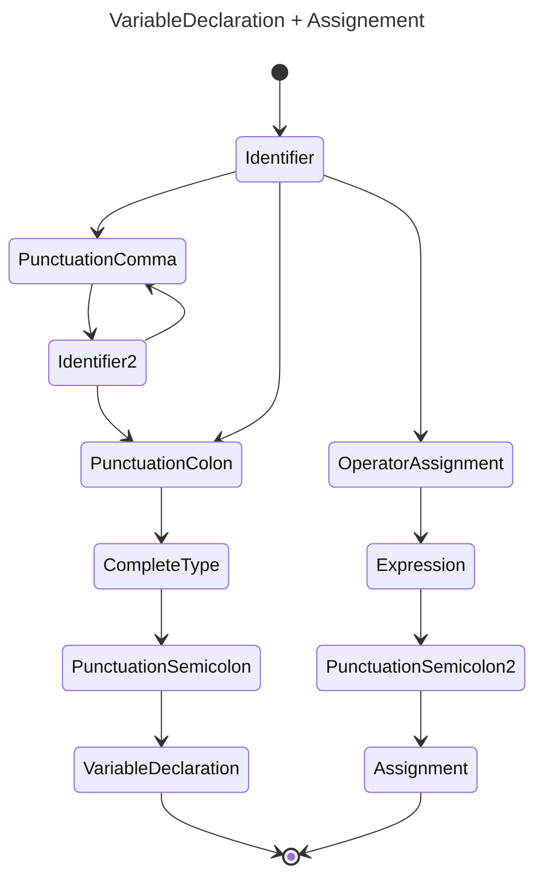
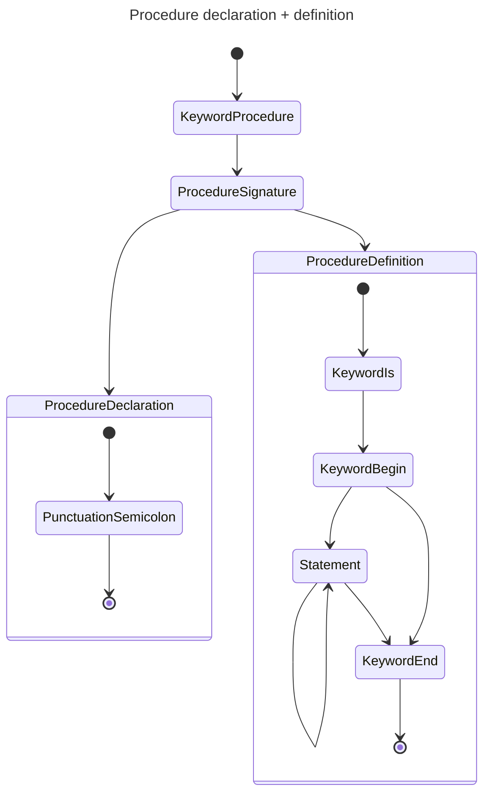

# Parsing tree

```mermaid
---
title: VariableDeclaration + Assignement
---
stateDiagram-v2

[*] --> Identifier
Identifier --> PunctuationComma
PunctuationComma --> Identifier2
Identifier2 --> PunctuationColon 
Identifier2 --> PunctuationComma 
Identifier --> PunctuationColon
PunctuationColon --> CompleteType
CompleteType --> PunctuationSemicolon
PunctuationSemicolon --> VariableDeclaration
VariableDeclaration --> [*]
Identifier --> OperatorAssignment
OperatorAssignment --> Expression
Expression --> PunctuationSemicolon2
PunctuationSemicolon2 --> Assignment
Assignment --> [*]
```

```mermaid
---
title: Procedure declaration + definition
---
stateDiagram-v2
[*] --> KeywordProcedure
KeywordProcedure --> ProcedureSignature
ProcedureSignature --> ProcedureDeclaration
ProcedureSignature --> ProcedureDefinition

state ProcedureDeclaration {
    [*] --> PunctuationSemicolon
    PunctuationSemicolon --> [*]
}

state ProcedureDefinition {
    [*] --> KeywordIs
    KeywordIs --> KeywordBegin
    KeywordBegin --> Statement
    Statement --> Statement
    Statement --> KeywordEnd
    KeywordBegin --> KeywordEnd
    KeywordEnd --> [*]
}
```
