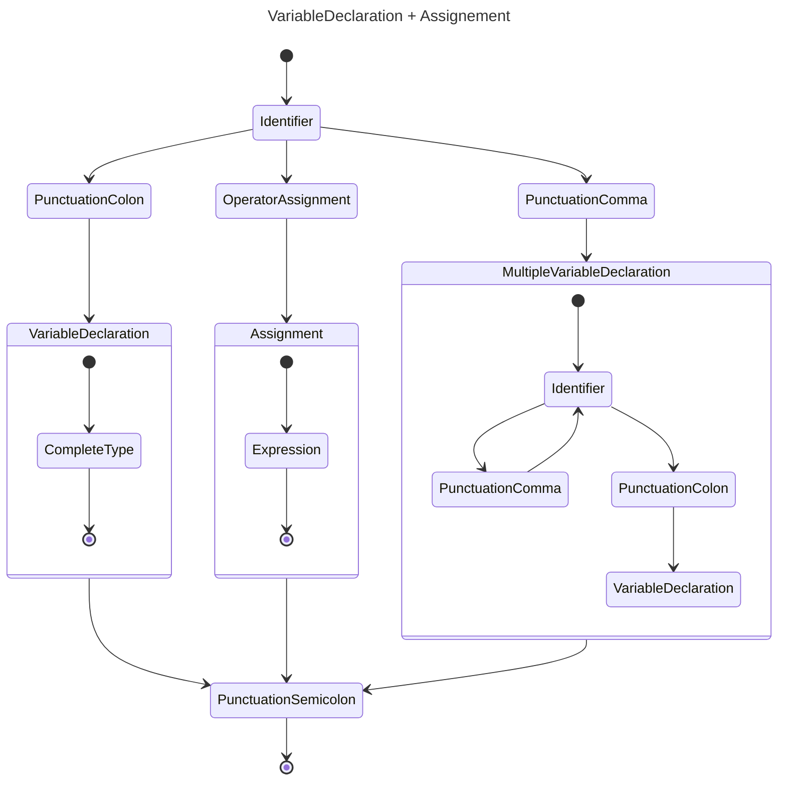
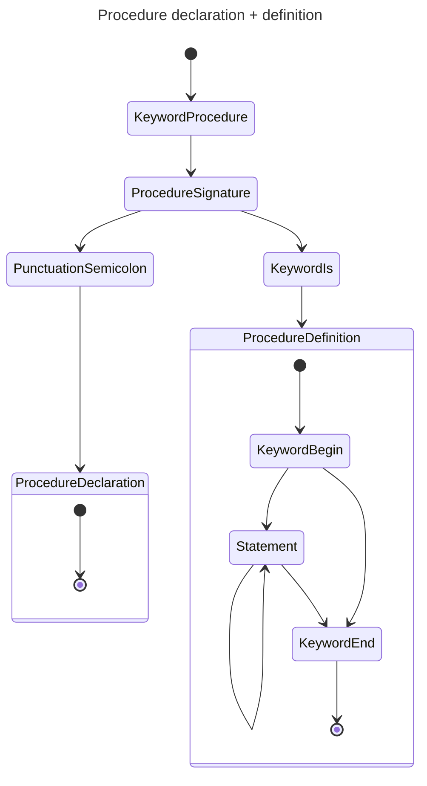

# Parsing tree

```mermaid
---
title: VariableDeclaration + Assignement
---
stateDiagram-v2

[*] --> Identifier
Identifier --> OperatorAssignment
Identifier --> PunctuationComma
Identifier --> PunctuationColon
OperatorAssignment --> Assignment
PunctuationColon --> VariableDeclaration
PunctuationComma --> MultipleVariableDeclaration

state VariableDeclaration {
    [*] --> CompleteType
    CompleteType --> [*]
}

state MultipleVariableDeclaration {
    ident : Identifier
    comma : PunctuationComma
    colon : PunctuationColon
    vdecl : VariableDeclaration
    [*] --> ident
    ident --> comma
    comma --> ident
    ident --> colon
    colon --> vdecl
}

state Assignment {
    [*] --> Expression
    Expression --> [*]
}

VariableDeclaration --> PunctuationSemicolon
Assignment --> PunctuationSemicolon
MultipleVariableDeclaration --> PunctuationSemicolon
PunctuationSemicolon --> [*]
```

```mermaid
---
title: Procedure declaration + definition
---
stateDiagram-v2
[*] --> KeywordProcedure
KeywordProcedure --> ProcedureSignature
ProcedureSignature --> PunctuationSemicolon
ProcedureSignature --> KeywordIs
PunctuationSemicolon --> ProcedureDeclaration
KeywordIs --> ProcedureDefinition

state ProcedureDeclaration {
    [*] --> [*]
}

state ProcedureDefinition {
    [*] --> KeywordBegin
    KeywordBegin --> Statement
    Statement --> Statement
    Statement --> KeywordEnd
    KeywordBegin --> KeywordEnd
    KeywordEnd --> [*]
}
```
