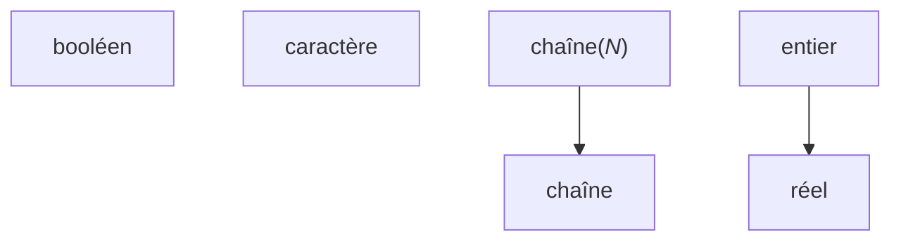

# Scratch area

## Errors that go token after token

fix errors going one from one token:

so basically when a parsing error occurs in a parsing loop, what we currently do is move to the next token and resume parsing from there.

So whenever an error occurs, get a bunch of other errors for the following tokens, even though they were valid.
If ecrireEcran is mispelled, we get "expected ecrireEcran" for all tokens up to the final semi.

### Solution 1 : ParseError should have a property for the minimal amount of expected tokens

Then we can just skip that amount of tokens next time we parse.

Unreliable since not all producton have a fixed amount of expected tokens.

### Solution 2 : who cares, it's not that big of a deal

It clutters the message list.

> **Minimize *cascaded* errors.** Once a single error is found, the parser no longer really knows what’s going on. It tries to get itself back on track and keep going, but if it gets confused, it may report a slew of ghost errors that don’t indicate other real problems in the code. When the first error is fixed, those phantoms disappear, because they reflect only the parser’s own confusion. Cascaded errors are annoying because they can scare the user into thinking their code is in a worse state than it is.(*<https://craftinginterpreters.com/parsing-expressions.html>*)

### Solution 3 : skim until first token of the target node, then resume parsing

this could actually work. We will have to know that first expected token type for every one tho. Or we could pass it to the Parse(Zero|One)OrMore* method.

We need to give the multi-parsing method an answer to the question "what is the type of the first token of the thing that i want you to parse".

It will need to be a params to account for cases where there may be multiple first tokens. And we will need to add a new argument to multi-parsing method. This will clutter the code and increase duplication.

### Solution 4 : skim until valid or failure with different error expected tokens (implemented)

`ParseError.IsEquivalent` because equality would incur comparison of ErroneousToken.

Requires comparison of ParseError, could work as well. Could result in missing errors if the errors have the same ExpectedTokens, they will get collapsed into one.

```text
programme HelloWorld c'est
début
    écrireEcran("")
    écrireEcran("")
    écrireEcran("")
    écrireEcran("")
fin
```

```text
[P0002] L 4, col 16: error: syntax error on Statement: expected PunctuationSemicolon; got 'écrireEcran'
        ---> écrireEcran("")
```

We get only one error for a missing semicolon with this algorithm (for `ParseZeroOrMoreUntilToken`)

```cs
while (!NextParsingTokenIsAny(endTokens).ValueOr(true)) {
    var item = parse(ParsingTokens);
    _readCount += Math.Max(1, item.SourceTokens.Count);

    if (item.HasValue || lastError is null || !item.Error.ExpectedTokens.SetEquals(lastError.ExpectedTokens)) {
        AddOrSyntaxError(items, item);
    }

    if (!item.HasValue) {
        lastError = item.Error;
    }
}
```

This seems to be the way GCC works.

```c
#include <stdio.h>

int main() {
    puts("")
    puts("")
    puts("")
    puts("")
}
```

```text
test.c: In function ‘main’:
test.c:4:13: error: expected ‘;’ before ‘puts’
    4 |     puts("")
      |             ^
      |             ;
    5 |     puts("")
      |     ~~~~ 
```

**Conclusion** : this solutions works, it's not that bad, but we can so better with **solutions 6 & 7**.

### Solution 5 : keep parsing after error in `ParseOperation`

Right now when a `ParseOperation` switches to the failure implementation it stops reading tokens altogether.

This means the tokens that are part of the thing we were trying to parse but are after the error will not be read, and will cause another error when we parse something else. Example

```text
programme HelloWorld c'est
début
    si 1 = 0 alors

    finsi
fin
```

We attempted to parse an `Alternative` but encoundered an integer literal `1` instead of an open bracket `(`.

So we stop parsing the `Alternative` and return a failed result.

We return to the statmeent multiparsing method and try to parse the next statement.

The `1` token is encountered, it doesn't correspond to any `statementParsers`. This causes an error with an empty `SourceTokens` so simply read 1 token.

We encounter equivalent errors for the `=`, `0`, `alors`, and finally `finsi` so they are not shown.

Finally we see `fin` which marks the end of our `MainProgram`.

```text
[P0002] L 3, col 5: error: expected `(` before integer literal `1`
    2 |     si 1 = 0 alors
      |     ^^^^
[P0002] L 3, col 8: error: expected statement before integer literal `1`
    2 |     si 1 = 0 alors
      |        ^
```

Now let's see what GCC outputs for an equivalent C program :

```c
int main() {
    if 1 == 0 {

    }
}
```

```text
test.c: In function ‘main’:
test.c:2:8: error: expected ‘(’ before numeric constant
    2 |     if 1 == 0 {
      |        ^
      |        (
```

There's only one error.

What we could do is simply :

1. When we fail due to the missing open bracket, register the failure (set a boolean in `ParseOperation`) but continue parsing as usual (return null and do not read the token so it can be parsed in the next step, but don't switch to the failure implementation)
2. When eventually we fail again due to encountering `alors` instead of the closing bracket `)`, apply the same strategy.
3. We should be able to finish parsing the if statement and we will get no superflous errors.

The question is, could this approach hide useful errors?

Also do we still need **Solution 4** if we implement this?

No i don't think so. If we take our previous example:

```text
programme HelloWorld c'est
début
    écrireEcran("")
    écrireEcran("")
    écrireEcran("")
    écrireEcran("")
fin
```

When we miss a semicolon we will simply ignore it (but still register the error).

So we will get 4 errors and not more since we won't be reading the next `écrireEcran`.

An adjustment that we should make though is keeping a list of the errors that occured in the `ParseOperation`. Since now that we don't stop on the first error we can have multiple errors.

This doesn't really work. For expressions it can result in infinite recursion if we allow not to parse the stuff that comes before the nested expression (such as the opening bracket in `Bracketed`). We can add a boolean parameter to force it to always parse, but there is another problem : it gets messy as we may end up parsing tokens that were never meant to be part of this production.

### Solution 6 : Panic mode synchronization productions

>Of all the recovery techniques devised in yesteryear, the one that best stood the test of time is called—somewhat alarmingly—panic mode. As soon as the parser detects an error, it enters panic mode. It knows at least one token doesn’t make sense given its current state in the middle of some stack of grammar productions.
>
>Before it can get back to parsing, it needs to get its state and the sequence of forthcoming tokens aligned such that the next token does match the rule being parsed. This process is called synchronization.
>
>To do that, we select some rule in the grammar that will mark the synchronization point. The parser fixes its parsing state by jumping out of any nested productions until it gets back to that rule. Then it synchronizes the token stream by discarding tokens until it reaches one that can appear at that point in the rule.
>
>Any additional real syntax errors hiding in those discarded tokens aren’t reported, but it also means that any mistaken cascaded errors that are side effects of the initial error aren’t falsely reported either, which is a decent trade-off.
>
>The traditional place in the grammar to synchronize is between statements.. *(Mistral AI)*
>
>Let's define the synchronization point token types. When an error occurs in multi-parsing, we will read until a synchronization point token is encountered (including it), and resume parsing.
>
>The exact list of synchronization points will depend on what we're parsing. (*<https://craftinginterpreters.com/parsing-expressions.htm>*)

Our synchronization points will be

- `Declaration`
- `Statement`

### Solution 7 : Error productions

> Another way to handle common syntax errors is with **error productions**. You augment the grammar with a rule that *successfully* matches the *erroneous* syntax. The parser safely parses it but then reports it as an error instead of producing a syntax tree. (*<https://craftinginterpreters.com/parsing-expressions.htm>*)

Error productions can be useful as a bonus, used in conjunction with **Solution 6** to provide more helpful error messages.

But they can't replace panic mode as it would be basically impossible to predict all possible syntax errors.

We can start from a list of most common syntax errors in similar languages, but let's implement panic mode first.

Another advantage of error productions that i see is the ability to provide alternative errors that the parser cannot detect on its own. For example, forgetting the actual parameter mode :

```text
proc(5);
```

Gives:

```text
[P0002] L 3, col 7: error: expected `)`, got integer literal `5`
    2 |     d(5);
      |       ^
[P0002] L 3, col 7: error: expected statement, got integer literal `5`
    2 |     d(5);
      |       ^
```

Ideas for error productions :

- Statment without semicolon
- Function/procedure signature without formal parameter modes
- Function/procedure call without actual parameter modes
- Incomplete type where complete type was expected

## Create a representation of the AST being built

We know the ast is build from the bottom up, but it could be interesting to see it animated.

Simply add some graph-building logic in the NodeImpl constructor.

## Contextual keyword

Keywords like `de`, `à`, `pas` are very short and only used in specific contexts.

They can use up useful symbol names.

We should make them contextal, ie. have them become identifier when outside of a designated context.

- `de` : array types, for loop begin part
- `à` : for loop end part
- `pas` : for loop step part

Maybe we could tokenize them as identifiers always and expect an identifier of a specific name in ParseOperation? (`ParseContextualKeyword`)

That seems like an easy way to implement this feature.

## Unified solution for operator precedence

For each code generator associate each operator with a precedence. So we always know whether to bracket an expression in non-terminal expressions.

Also add boolean argument `bracketed` to appendexpression so we don't need `AppendBracketedExpression`.

## Possibility of duplicate errors

Errors may be duplicated between the static analyzer and the code generator.

The issue is that we're doing duplicate work to evaluate types. So maybe we should add a types lookup table.

## Alias reference unwrap madness

We need to prefix every operation we make with `EvaluatedType`s with Unwrap to get the true type by discarding any alias references in the way.

We need a different solution so the type of an instance is the same as its actual type (so we can perform is checks).

Maybe we can have a type remember which alias, if any it belongs to?

## custom logic to parse and language-specific way to print literals

current we use `CultureInfo.Invariant`, which seems to works but not sure if it covers all edge cases. Cleanest way is to use our own algorithms.

Also specific target language may use different syntax for literals.

## StringLenghted and constant folding

`StringLenghted` shouldn't exist. Only `StringKnownLength` should. That's because a string length should always be a constant value. But we can't enforce that right now because we cannot evaluate all constant expressions.

We will need constant folding. I didn't think we would, but we do. Hopefully it shouldn't be too hard.

It's weird that i need this for such a niche part, that is, controlling assignment between different string types.

```text
s1 : chaîne(20);

s2 : chaîne(10 + 10);

s2 := s1;
```

```c
char s1[20];
char s2[10 + 20];

// s1 = s2; // nope! can't reassign arrays in C.
strcpy(s1, s2);
strncpy(s1, s2, 20);
```

I *could* disallow reassigning lengthed strings entirely, but that feels like a pointless limitation. Considering that we've been taught to use `strcpy`, i should use it.

Also this means we won't need `IsConstant` anymore, since any expression that is constant will now be able have its value evaluated.

In order to generate the strcpy calls we will need something to control assignment in `TypeInfo` too.

Gosh this is getting complex. And I haven't even implemented the whole language yet.

I definitely will not use constant folding as an optimization though, because the objective of this whole project is to generate C code that matches the input in behavior **and** semantics.

same for array dimensions

We need to think about which operations we allow for which types.

Row header is the result type

Cells contain operand types. If there's only one it's the type of all operands. One supported operation per line.

arity|operator|booléen|caractère|chaîne|entier|réel
-|-|-|-|-|-|-
2|And|booléen|||||
2|Divide||||entier|réel|
2|Equal|booléen<br>caractère<br>chaîne<br>entier<br>réel|||||
2|GreaterThan|entier<br>réel|||||
2|GreaterThanOrEqual|entier<br>réel|||||
2|LessThan|entier<br>réel|||||
2|LessThanOrEqual|entier<br>réel|||||
2|Minus||||entier|réel|
2|Modulus||||entier|réel|
2|Multiply||||entier|réel|
2|NotEqual|booléen<br>caractère<br>chaîne<br>entier<br>réel|||||
2|Or|booléen|||||
2|Plus||||entier|réel|
1|UnaryMinus||||entier|réel|
1|UnaryNot|booléen|||||
1|UnaryPlus||||entier|réel|
2|Xor|booléen|||||

The Pseudocode type system is safe, albeit rather limited.

Strings only support equality. It wouldn't be hard to add support for comparision, but it gets confusing. What do we mean by `"foo" > "bar"`? The lexicographical comparison provided by `strcmp` is not obvious. And what about empty strings or strings of different lengths? Too many edge cases and choices to make. The user can implement string comparison themselves.
But it would be nice to have a `strcmp` standard library function available, so we have one way to compare strings without resorting to a custom implementation. Maybe one day.

Since we don't have casting, we must avoid arbitrary restrictions.

### Implicit conversions



**Characters are not integers**. Yes, they are represented by integers, but that's an implementation detail. Pseudocode focuses on semantics, not technicalities.

Strings with a known length are considered unlenghted strings. The length is specified at declaration but is not needed for consumption since the strings are null-terminated.

Booleans are not considered integers, as this is a behavior inherited from C and it doesn't make sense to perform arithmetic operations on booleans. The true/false concept is separate from integers, and the fact that it maps to 0/1 is an implementation detail.

## Parsing trees

Currently, our overload of `Branch` that returns a `ParseOperation` so the parsing doesn't work, as it fails to account for tokens parsed after the merge.
