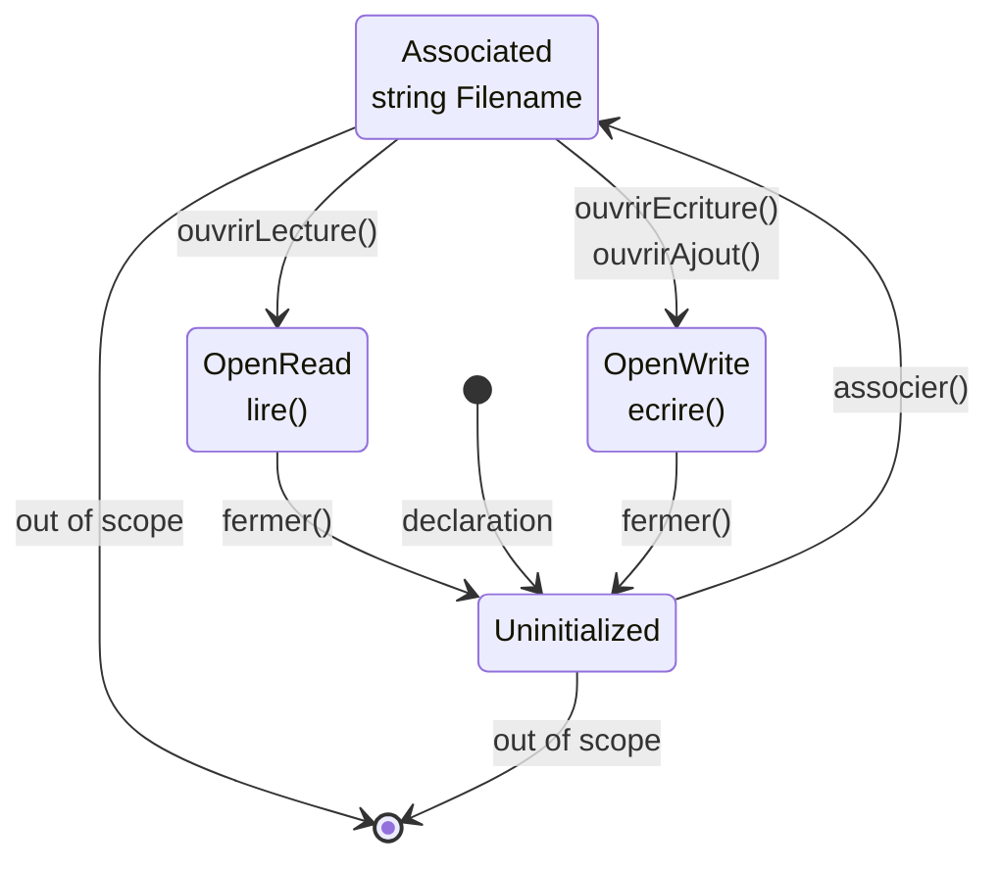

# Scratch area

## Test suite

Do they check character by character or C tokens? In other words, do they depend on formatting?

## Custom formatting

Output a minified version of the code and run a formatter, either from C# or external process

## Errors that go token after token

fix errors going one from one token:

so basically when a parsing error occurs in a parsing loop, what we currently do is move to the next token and resume parsing from there.

So whenever an error occurs, get a bunch of other errors for the following tokens, even though they were valid.
If ecrireEcran is mispelled, we get "expected ecrireEcran" for all tokens up to the final semi.

### Solution 1 : ParseError should have a property for the minimal amount of expected tokens

Then we can just skip that amount of tokens next time we parse.

Unreliable since not all producton have a fixed amount of expected tokens.

### Solution 2 : who cares, it's not that big of a deal

It clutters the message list.

> **Minimize *cascaded* errors.** Once a single error is found, the parser no longer really knows what’s going on. It tries to get itself back on track and keep going, but if it gets confused, it may report a slew of ghost errors that don’t indicate other real problems in the code. When the first error is fixed, those phantoms disappear, because they reflect only the parser’s own confusion. Cascaded errors are annoying because they can scare the user into thinking their code is in a worse state than it is.(*<https://craftinginterpreters.com/parsing-expressions.html>*)

### Solution 3 : skim until first token of the target node, then resume parsing

this could actually work. We will have to know that first expected token type for every one tho. Or we could pass it to the Parse(Zero|One)OrMore* method.

We need to give the multi-parsing method an answer to the question "what is the type of the first token of the thing that i want you to parse".

It will need to be a params to account for cases where there may be multiple first tokens. And we will need to add a new argument to multi-parsing method. This will clutter the code and increase duplication.

### Solution 4 : skim until valid or failure with different error expected tokens (implemented)

`ParseError.IsEquivalent` because equality would incur comparison of ErroneousToken.

Requires comparison of ParseError, could work as well. Could result in missing errors if the errors have the same ExpectedTokens, they will get collapsed into one.

```text
programme HelloWorld c'est
début
    écrireEcran("")
    écrireEcran("")
    écrireEcran("")
    écrireEcran("")
fin
```

```text
[P0002] L 4, col 16: error: syntax error on Statement: expected PunctuationSemicolon; got 'écrireEcran'
        ---> écrireEcran("")
```

We get only one error for a missing semicolon with this algorithm (for `ParseZeroOrMoreUntilToken`)

```cs
while (!NextParsingTokenIsAny(endTokens).ValueOr(true)) {
    var item = parse(ParsingTokens);
    _readCount += Math.Max(1, item.SourceTokens.Count);

    if (item.HasValue || lastError is null || !item.Error.ExpectedTokens.SetEquals(lastError.ExpectedTokens)) {
        AddOrSyntaxError(items, item);
    }

    if (!item.HasValue) {
        lastError = item.Error;
    }
}
```

This seems to be the way GCC works.

```c
#include <stdio.h>

int main() {
    puts("")
    puts("")
    puts("")
    puts("")
}
```

```text
test.c: In function ‘main’:
test.c:4:13: error: expected ‘;’ before ‘puts’
    4 |     puts("")
      |             ^
      |             ;
    5 |     puts("")
      |     ~~~~ 
```

**Conclusion** : this solutions works, it's not that bad, but we can so better with **solutions 6 & 7**. It gives a lot of weird errors.

### Solution 5 : keep parsing after error in `ParseOperation`

Right now when a `ParseOperation` switches to the failure implementation it stops reading tokens altogether.

This means the tokens that are part of the thing we were trying to parse but are after the error will not be read, and will cause another error when we parse something else. Example

```text
programme HelloWorld c'est
début
    si 1 = 0 alors

    finsi
fin
```

We attempted to parse an `Alternative` but encoundered an integer literal `1` instead of an open bracket `(`.

So we stop parsing the `Alternative` and return a failed result.

We return to the statmeent multiparsing method and try to parse the next statement.

The `1` token is encountered, it doesn't correspond to any `statementParsers`. This causes an error with an empty `SourceTokens` so simply read 1 token.

We encounter equivalent errors for the `=`, `0`, `alors`, and finally `finsi` so they are not shown.

Finally we see `fin` which marks the end of our `MainProgram`.

```text
[P0002] L 3, col 5: error: expected `(` before integer literal `1`
    2 |     si 1 = 0 alors
      |     ^^^^
[P0002] L 3, col 8: error: expected statement before integer literal `1`
    2 |     si 1 = 0 alors
      |        ^
```

Now let's see what GCC outputs for an equivalent C program :

```c
int main() {
    if 1 == 0 {

    }
}
```

```text
test.c: In function ‘main’:
test.c:2:8: error: expected ‘(’ before numeric constant
    2 |     if 1 == 0 {
      |        ^
      |        (
```

There's only one error.

What we could do is simply :

1. When we fail due to the missing open bracket, register the failure (set a boolean in `ParseOperation`) but continue parsing as usual (return null and do not read the token so it can be parsed in the next step, but don't switch to the failure implementation)
2. When eventually we fail again due to encountering `alors` instead of the closing bracket `)`, apply the same strategy.
3. We should be able to finish parsing the if statement and we will get no superflous errors.

The question is, could this approach hide useful errors?

Also do we still need **Solution 4** if we implement this?

No i don't think so. If we take our previous example:

```text
programme HelloWorld c'est
début
    écrireEcran("")
    écrireEcran("")
    écrireEcran("")
    écrireEcran("")
fin
```

When we miss a semicolon we will simply ignore it (but still register the error).

So we will get 4 errors and not more since we won't be reading the next `écrireEcran`.

An adjustment that we should make though is keeping a list of the errors that occured in the `ParseOperation`. Since now that we don't stop on the first error we can have multiple errors.

This doesn't really work. For expressions it can result in infinite recursion if we allow not to parse the stuff that comes before the nested expression (such as the opening bracket in `Bracketed`). We can add a boolean parameter to force it to always parse, but there is another problem : it gets messy as we may end up parsing tokens that were never meant to be part of this production.

### Solution 6 : Panic mode synchronization productions

>Of all the recovery techniques devised in yesteryear, the one that best stood the test of time is called—somewhat alarmingly—panic mode. As soon as the parser detects an error, it enters panic mode. It knows at least one token doesn’t make sense given its current state in the middle of some stack of grammar productions.
>
>Before it can get back to parsing, it needs to get its state and the sequence of forthcoming tokens aligned such that the next token does match the rule being parsed. This process is called synchronization.
>
>To do that, we select some rule in the grammar that will mark the synchronization point. The parser fixes its parsing state by jumping out of any nested productions until it gets back to that rule. Then it synchronizes the token stream by discarding tokens until it reaches one that can appear at that point in the rule.
>
>Any additional real syntax errors hiding in those discarded tokens aren’t reported, but it also means that any mistaken cascaded errors that are side effects of the initial error aren’t falsely reported either, which is a decent trade-off.
>
>The traditional place in the grammar to synchronize is between statements.. *(Mistral AI)*
>
>Let's define the synchronization point token types. When an error occurs in multi-parsing, we will read until a synchronization point token is encountered (including it), and resume parsing.
>
>The exact list of synchronization points will depend on what we're parsing. (*<https://craftinginterpreters.com/parsing-expressions.htm>*)

Our synchronization points will be

- `Declaration`
- `Statement`

### Solution 7 : Error productions

> Another way to handle common syntax errors is with **error productions**. You augment the grammar with a rule that *successfully* matches the *erroneous* syntax. The parser safely parses it but then reports it as an error instead of producing a syntax tree. (*<https://craftinginterpreters.com/parsing-expressions.htm>*)

Error productions can be useful as a bonus, used in conjunction with **Solution 6** to provide more helpful error messages.

But they can't replace panic mode as it would be basically impossible to predict all possible syntax errors.

We can start from a list of most common syntax errors in similar languages, but let's implement panic mode first.

Another advantage of error productions that i see is the ability to provide alternative errors that the parser cannot detect on its own. For example, forgetting the actual parameter mode :

```text
proc(5);
```

Gives:

```text
[P0002] L 3, col 7: error: expected `)`, got integer literal `5`
    2 |     d(5);
      |       ^
[P0002] L 3, col 7: error: expected statement, got integer literal `5`
    2 |     d(5);
      |       ^
```

Ideas for error productions :

- Statment without semicolon
- Function/procedure signature without formal parameter modes
- Function/procedure call without actual parameter modes
- Incomplete type where complete type was expected
- faire instead of alors / alors instead of faire

## Optimization: avoid dict lookup when inferred type is known

For literals

Encapsulate the dic in a class which supports this.

## should we consume the failure token

The following syntax error:

```text
si (n == 0) faire
        retourne faux;
finsi
```

`faire` instead of `alors`.

We read up to `)`, then we fail parsing the `Alternative` on the `faire`

The `faire` is interpreted as the beginning do..while loop, which goes on forever since there is no `tant que` in sight, causing cascading errors.

We would still get some cascading errors, but we wouldn't have the same issue.

So should we read that tokens?

Well i don't know. It would be a bad idea to if it hid useful errors or create more cascading errors. But maybe it doesn't?

It create more cascading errors if the failed token is the start of another production.

What we can do. Try to parse including the failure token. If failed, read it. Or better, just skim each token that follows the failure token (including it) until we manage to parse.

In any case, we can just make a bajillion error productions to counteract this.

## Create a representation of the AST being built

We know the ast is build from the bottom up, but it could be interesting to see it animated.

Simply add some graph-building logic in the NodeImpl constructor.

## Contextual keywords

Keywords like `de`, `à`, `pas` are very short and only used in specific contexts.

They can use up useful symbol names.

We should make them contextal, ie. have them become identifier when outside of a designated context.

- `de` : array types, for loop begin part
- `à` : for loop end part
- `pas` : for loop step part

Maybe we could tokenize them as identifiers always and expect an identifier of a specific name in ParseOperation? (`ParseContextualKeyword`)

That seems like an easy way to implement this feature.

## Modularity

Add support for modularity.

I think we should have two preprocessor directives for reusing code in other files.

### `#include`

Dumb. Like in C. Expands into the contents of the included file.

### `#use`

Smarter. Useful for libraries. Like includes but only referenced declarations are copied. (and the declarations they themselves reference, trees.)

Basically does tree-shaking from the start.

## File handling PSC &rarr; C

### Step 1. Declaration

element|description|implementation
-|-|-
`nomFichierLog`|Type for a file handle|`FILE*` in C. Start uninitialized.
`assigner()`|Associates the filename so it can be opened later. The file handle is not in an usable state yet.|Put filename in a dictionary so it can be retrieved later.

### Step 2. Opening

element|description|implementation
-|-|-
`ouvrirAjout()`|Opens a file for appending|`file = fopen(filename, "a")`. Abort on null.
`ouvrirLecture()`|Opens a file for reading|`file = fopen(filename, "r")`. Abort on null.
`ouvrirEcriture()`|Opens a file for writing|`file = fopen(filename, "w")`. Abort on null.

### Step 3. Usage

element|description|implementation
-|-|-
`lire()`|read from the file|`fread(var, sizeof var, 1, file)`
`ecrire()`|write to the file|`fwrite(val, sizeof val, 1, file)`
`fdf()`|check if eof|`feof(file)`

### Step 4. Cleanup

element|description|implementation
-|-|-
`fermer()`|closes a file|`fclose(file)`. The file can no longer be used.

### Considerations

Warnings on invalid operation

### Implementation ideas

**Let files be state machines**. Keep track of its state. Arrows indicate allowed transitions.



Anytime we try to take a transition that doesn't exist, a warning occurs : "Warning: {operation} {state} file".

Example : "Warning: reading closed file", "Warning: opening opened file", "Warning: reading from write-only file"

That also includes going out of scope as a transition. Except this transition transitions to non-existence of the file. This is to get a warning when an unclosed file goes out of scope.

To implement this, state will have to be a discriminated union (for the string property) instead of the typical enum.

In the code generator we will have a dictionary of declared files. We will progress through the state on each node we encounter. Each transition method will return the previous state.

The problem is for static analysis. If static analysis already did all the transitions, we'll have to start from scratch in the code generator. This feels stupid.

Plus it was better when we just had a scope that we could push/pop.

Do you think we should merge static analysis and code generation?

And what happens if we return a file or pass it to a function/procedure. We should stop all analysis and consider the user knows what they are doing. I'm not writing a static analyzer. I just need to restructure the information from the AST in order to generate C code. If we can get some diagnostics along the way, that'd be nice.

Also what happens of closing the file occurs in a if statement? How do we know for sure it's been closed? Can we analyze the truthfulness of the condition? You can push static analysis further and further to support scenarios that are unlikely to happen in real code anyway. It's difficult to implement. I won't do that.

## thoughts on parser blocks

Interesting idea, avoids having to create meaningless `ParseOperation`s. Needs overloads.

Parser blocks are useful when 2 conditions are met:

- We don't use the produced `SourceTokens` (discard it in the result)
- The production name is the same

In any case, it's only really useful for optimization and DRY. So low priority.

## code formatting

Explicit non-default access modifiers everywhere, remove them if default.

Sort members.

## call a function as a statement

self-explanatory.

## more expression static analysis

- Check if file arguments to file builtins are files
- Check for loop start, step and end
    - start must be assignable to variant
    - variant and step must support operator '+'
    - variant and end must support operator '<'
    - so I need a way to query which operators are supported between 2 types. Oh no.

- Check the type and const-ness of each case
- Check if condition is a boolean in alternatives and loops
- Check the assignability of target and value in assignment
- Check if return value corresponds to function's return type

## Configuration

Ecrire (`ecrire`, `ecrireEcran`) newline control

Different ways to configure (ordered by predecence, lower value replace higher values):

location|scope|syntax
-|-|-
config json file|global|`{ "ecrire-nl": vrai }`
CLI options|global|`--config ecrire-nl:vrai`
preprocessor directives|current file|`#config ecrire-nl := (expr)`<br>`#config ecrire-nl reset` &rarr; resets to inherited value

config names are normalized so that `écrire-nl` is equivalent to `ecrire-nl`.

## Preprocessor directives

Add infrastructure to later implement

- `#config`
- `#include`/`#import`
- ...

Since a PD can be located anywher in the program, it cannot be parsed as part of the normal syntax, unless we want to make the grammar extremely messy.

### Implementation

#### 1. Run a preprocessor

Works for things like #include but would require rewriting static analyisis for PD like `#compiler log`.

#### 2. Token channels (like in ANTLR)

Basically return a separate list for the PD-related tokens.

## Trailing commas

Allow trailing commas in parameter lists, local variable lists, array subscripts.

## Parsing: put LBracket in SourceTokens of ArraySubscript

To get prettier error messages.

## GNU-compliant message formatting

We should adhere to what's standard.

## Test compile-time values

We'll need all kinds of expressions that yield comptime-known integers.

Tests (increasing complexity):

- Literal
- Computation (combine multiple operations that yield a constant result)
    - Addition
    - Substraction
    - Division
    - Mod
    - Cast from real
    - Cast from bool
        - vrai
        - faux
        - Not
        - Or
        - And
        - Xor
- Scalar constant
- Array constant
    - no designators
    - with designators
    - only designators
- Structure constant
    - no designators
    - with designators
    - only designators
- Structure > Array constant
- Array > Structure constant

## Compiler directives

Compiler directives are compile-time instructions that are evaluated in the static analyzer. They may be translated to the target lanugage (see C's `static_assert`), but they do not affect the machine code output of the target language compilation.

Preprocessor directives don't require static analysis: `#include`, `#config`. Other stuff, like compiler log, static asserts, are semantically similar to statetements and should appear as such. Maybe we should reuse Zig's syntax for builtins: `@compilerLog`, `@assert`... except the `@` symbol indicates that this call is evaluated at compile-time and does not affect the machine code output.

They require the context given by static analysis to run (otherwise we'd use preprocessor directives whih)

### `@log`

Logs the value status of an expression as a message. (including comptime value if present)

Add a new category of message: Debug. Shown in light green.

MessageCode.CompilerLog

### `@assert`

These "compiler directives" can be either declarations or statements, so they can appear at the top level or in a function body.

Do we even need these? Not if we can find a way to:

### Implementation

- Parse them as compiler directives (CDs) using a separate token chanel and a new parser class
- Somehow able them to be evaluated in the SA, in the context of regular AST nodes. I see solutions for this:
    - Somehow put CDs in the regular AST: nope
    - Put them in a list that is passed alongside the AST (no need for a tree since they are sequential). Compare the source tokens of each AST node to progress gradually through the list of CDs, and evaluate them when we move down one: nope
    - Same as above, but somehow keep a context so we don't have to compare the SourceTokens of every analyzed AST node to locate the CD: ok
        - Maybe keep a reference, in the CD, to the last non-CD token parsed. Then if the SourceTokens of the node contain this token:
            - if this token is the last token of the node, then it the CD comes after the node, so evaluate it after the node.
            - otherwise, it is inside the node, so evaluate it before
